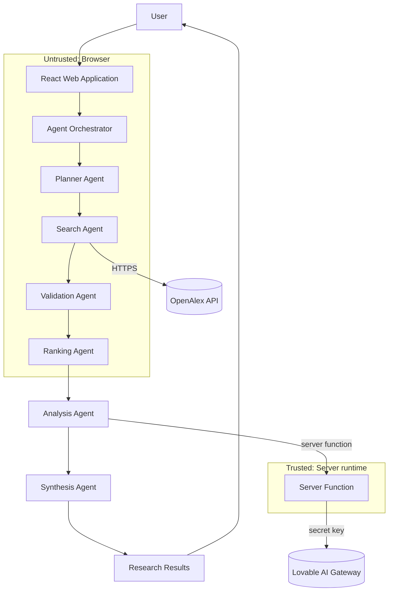

## ResearchMate Enterprise Architecture

### Layers
| Layer | Implementation |
|---|---|
| Presentation Layer | React 19 + Tailwind CSS pages: Research, Agent Workflow, Capstone Deliverables, About |
| Application Layer | Agent orchestrator in the Research page (`src/routes/index.tsx`) driving state and UI updates |
| Agent Layer | Planner, Search, Validation, Ranking agents (`src/lib/agents.ts`); Analysis + Synthesis (`src/lib/analysis.functions.ts`) |
| Research API Integration Layer | OpenAlex Works API (public, no key) with 15 s timeout and one retry |
| AI/Analysis Layer | Lovable AI Gateway called from a server function; deterministic fallback in the browser |
| Monitoring Layer | Design only (see deliverable 05); platform server logs + browser console today |

### Diagram

### Components
- `SiteHeader` – navigation; `index.tsx` – research UI + orchestrator; `agents.ts` – agent logic; `analysis.functions.ts` – AI server function.

### Data flow
Query → Plan → OpenAlex records → validated records → ranked top 8 → (title, year, source, abstract) sent to server → AI JSON analysis → rendered report.

### Trust boundaries
1. Browser ↔ OpenAlex: public data, read-only.
2. Browser ↔ Server function: input validated with Zod (≤500 chars, ≤10 papers).
3. Server ↔ AI Gateway: authenticated by `LOVABLE_API_KEY` held only on the server.

### External integrations
OpenAlex (scholarly metadata), Lovable AI Gateway (summarization). Crossref was not implemented.

### Security boundaries
No secrets in frontend code, no user accounts, no database, no persisted personal data.
