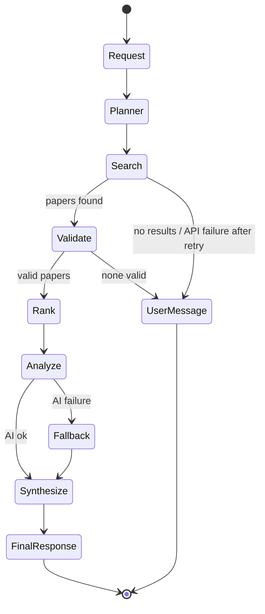

## ResearchMate Agent Workflow Design

### Agent roles, inputs, outputs, tools
| Agent | Input | Output | Tool |
|---|---|---|---|
| Planner | User question | Topic, keywords, intent, optional year filter | Deterministic keyword extraction |
| Search | Plan | Raw paper records | OpenAlex Works API |
| Validation | Raw records | De-duplicated records with year + DOI/URL | Metadata + duplicate checks |
| Ranking | Valid records, plan | Top 8 with score 0–100 | Formula: keyword 50 + recency 20 + abstract 15 + metadata 15 |
| Analysis | Top papers | Summary, contribution, topic, finding, limitation | Lovable AI (server) / abstract sentence fallback |
| Synthesis | Analyzed papers | Themes, findings, approaches, differences, gaps, read-first | Lovable AI / term-frequency fallback |

### State transitions
Each agent: `idle → running → done` or `running → error`. The workflow halts on the first error and shows a user message.

### Handoffs
`Plan → Paper[] → ValidatedPaper[] → RankedPaper[] → PaperAnalysis[] → Synthesis` (typed TypeScript objects).

### Failure handling
- Search failure → retry once → user message
- No results → "No research papers were found for this query. Try using broader keywords."
- Invalid metadata → filtered; missing fields shown as "Metadata unavailable"
- AI failure → deterministic fallback from real abstracts
- Network timeout → 15 s abort, retry, then friendly message

### Human interaction / approvals
The user initiates research, watches each agent's live status, inspects the score breakdown (hover), and verifies papers via the real DOI link before use. No autonomous actions beyond read-only search are taken.
