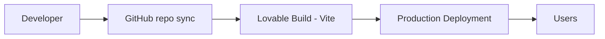

## ResearchMate Deployment Strategy

### Environments
| Environment | Description |
|---|---|
| Development | Lovable editor sandbox running the Vite dev server |
| Testing | Lovable preview URL – every change is built and viewable before release |
| Production | Lovable published URL |

### Pipeline

### Runtime
TanStack Start (React 19) app. Static assets and server-side rendering plus one server function run on Lovable's managed edge/serverless hosting.

### Build
`vite build` produces client and server bundles. TypeScript and lint checks run as part of the build.

### Environment variables
`LOVABLE_API_KEY` – managed server-side secret for Lovable AI. OpenAlex needs no key.

### API configuration
OpenAlex base URL `https://api.openalex.org/works`; AI Gateway `https://ai.gateway.lovable.dev/v1/responses`.

### Basic scalability
The app is stateless (no database, no sessions), so capacity scales with the hosting platform. OpenAlex public rate limits apply.

### Error handling & availability
Timeouts, retries and deterministic AI fallback keep the app usable when a dependency fails. Availability depends on Lovable hosting and OpenAlex.

### Rollback & release
Releases happen by clicking Publish/Update in Lovable. Rollback is done by restoring a previous version from Lovable history (or reverting the GitHub commit) and republishing.

No Kubernetes, multi-region infrastructure, or autoscaling clusters are used.
