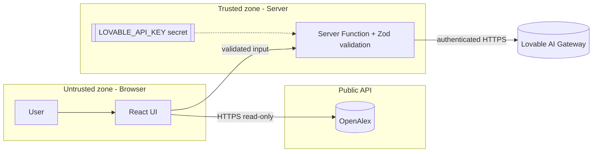

## ResearchMate Security Model

| Area | Approach |
|---|---|
| Identity | No user accounts — the app is anonymous and read-only by design |
| Authorization | No privileged operations exist; the only server function performs analysis and returns text |
| Secrets management | `LOVABLE_API_KEY` stored as a managed server secret, read only inside the server function; never in React code or Git |
| API security | HTTPS to OpenAlex and AI Gateway; the key is sent only from server to gateway |
| Input validation | Query trimmed, 3–500 chars; server validates with Zod (≤10 papers, typed fields); abstracts truncated to 1200 chars |
| Prompt injection awareness | Paper text is passed as JSON data and the prompt instructs the model to treat it as data, not instructions |
| Data privacy | No queries or personal data are stored; no cookies or analytics added by the app |
| AI guardrails | Model told to use only supplied metadata and answer "Not stated in available metadata" otherwise; papers/DOIs/URLs always come from OpenAlex, never from AI |
| Logging | Platform server logs and browser console for errors only |
| Auditability | Every paper links to its real DOI/landing page; ranking score breakdown visible on hover; UI labels whether AI or fallback was used |

