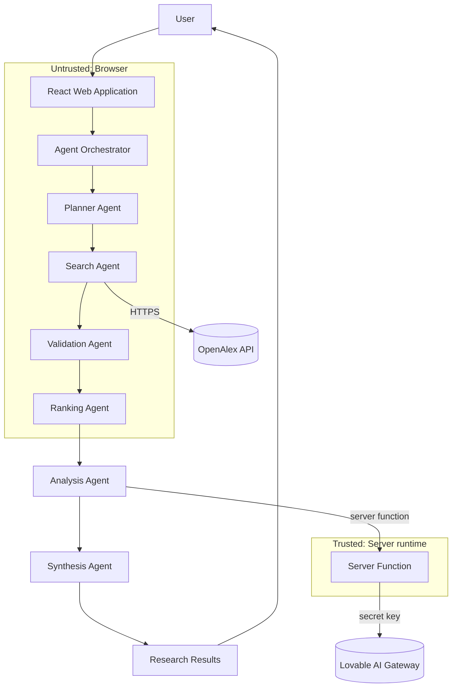
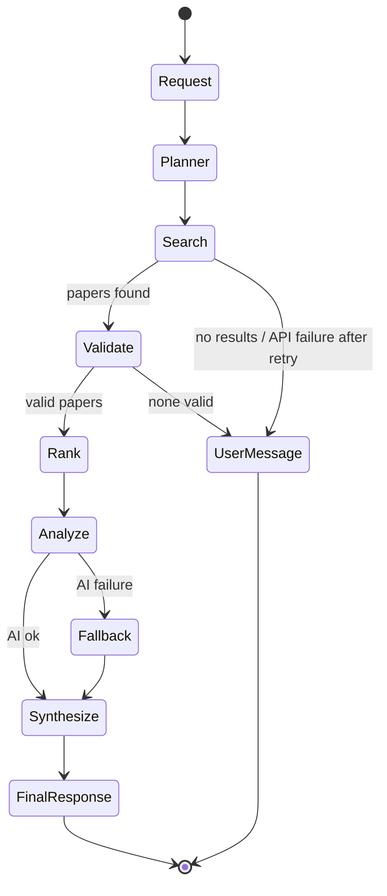
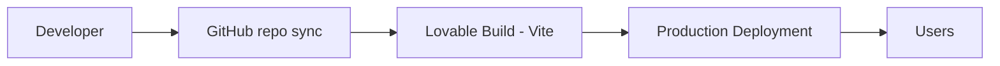
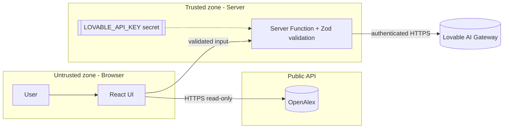

# ResearchMate – Capstone Deliverables

## 1. Architecture Diagram


#### Layers
| Layer | Implementation |
|---|---|
| Presentation Layer | React 19 + Tailwind CSS pages: Research, Agent Workflow, Capstone Deliverables, About |
| Application Layer | Agent orchestrator in the Research page (`src/routes/index.tsx`) driving state and UI updates |
| Agent Layer | Planner, Search, Validation, Ranking agents (`src/lib/agents.ts`); Analysis + Synthesis (`src/lib/analysis.functions.ts`) |
| Research API Integration Layer | OpenAlex Works API (public, no key) with 15 s timeout and one retry |
| AI/Analysis Layer | Lovable AI Gateway called from a server function; deterministic fallback in the browser |
| Monitoring Layer | Design only (see deliverable 05); platform server logs + browser console today |

#### Diagram


#### Components
- `SiteHeader` – navigation; `index.tsx` – research UI + orchestrator; `agents.ts` – agent logic; `analysis.functions.ts` – AI server function.

#### Data flow
Query → Plan → OpenAlex records → validated records → ranked top 8 → (title, year, source, abstract) sent to server → AI JSON analysis → rendered report.

#### Trust boundaries
1. Browser ↔ OpenAlex: public data, read-only.
2. Browser ↔ Server function: input validated with Zod (≤500 chars, ≤10 papers).
3. Server ↔ AI Gateway: authenticated by `LOVABLE_API_KEY` held only on the server.

#### External integrations
OpenAlex (scholarly metadata), Lovable AI Gateway (summarization). Crossref was not implemented.

#### Security boundaries
No secrets in frontend code, no user accounts, no database, no persisted personal data.

## 2. Agent Workflow Design


#### Agent roles, inputs, outputs, tools
| Agent | Input | Output | Tool |
|---|---|---|---|
| Planner | User question | Topic, keywords, intent, optional year filter | Deterministic keyword extraction |
| Search | Plan | Raw paper records | OpenAlex Works API |
| Validation | Raw records | De-duplicated records with year + DOI/URL | Metadata + duplicate checks |
| Ranking | Valid records, plan | Top 8 with score 0–100 | Formula: keyword 50 + recency 20 + abstract 15 + metadata 15 |
| Analysis | Top papers | Summary, contribution, topic, finding, limitation | Lovable AI (server) / abstract sentence fallback |
| Synthesis | Analyzed papers | Themes, findings, approaches, differences, gaps, read-first | Lovable AI / term-frequency fallback |

#### State transitions
Each agent: `idle → running → done` or `running → error`. The workflow halts on the first error and shows a user message.



#### Handoffs
`Plan → Paper[] → ValidatedPaper[] → RankedPaper[] → PaperAnalysis[] → Synthesis` (typed TypeScript objects).

#### Failure handling
- Search failure → retry once → user message
- No results → "No research papers were found for this query. Try using broader keywords."
- Invalid metadata → filtered; missing fields shown as "Metadata unavailable"
- AI failure → deterministic fallback from real abstracts
- Network timeout → 15 s abort, retry, then friendly message

#### Human interaction / approvals
The user initiates research, watches each agent's live status, inspects the score breakdown (hover), and verifies papers via the real DOI link before use. No autonomous actions beyond read-only search are taken.

## 3. Deployment Strategy


#### Environments
| Environment | Description |
|---|---|
| Development | Lovable editor sandbox running the Vite dev server |
| Testing | Lovable preview URL – every change is built and viewable before release |
| Production | Lovable published URL |

#### Pipeline


#### Runtime
TanStack Start (React 19) app. Static assets and server-side rendering plus one server function run on Lovable's managed edge/serverless hosting.

#### Build
`vite build` produces client and server bundles. TypeScript and lint checks run as part of the build.

#### Environment variables
`LOVABLE_API_KEY` – managed server-side secret for Lovable AI. OpenAlex needs no key.

#### API configuration
OpenAlex base URL `https://api.openalex.org/works`; AI Gateway `https://ai.gateway.lovable.dev/v1/responses`.

#### Basic scalability
The app is stateless (no database, no sessions), so capacity scales with the hosting platform. OpenAlex public rate limits apply.

#### Error handling & availability
Timeouts, retries and deterministic AI fallback keep the app usable when a dependency fails. Availability depends on Lovable hosting and OpenAlex.

#### Rollback & release
Releases happen by clicking Publish/Update in Lovable. Rollback is done by restoring a previous version from Lovable history (or reverting the GitHub commit) and republishing.

No Kubernetes, multi-region infrastructure, or autoscaling clusters are used.

## 4. Security Model


| Area | Approach |
|---|---|
| Identity | No user accounts — the app is anonymous and read-only by design |
| Authorization | No privileged operations exist; the only server function performs analysis and returns text |
| Secrets management | `LOVABLE_API_KEY` stored as a managed server secret, read only inside the server function; never in React code or Git |
| API security | HTTPS to OpenAlex and AI Gateway; the key is sent only from server to gateway |
| Input validation | Query trimmed, 3–500 chars; server validates with Zod (≤10 papers, typed fields); abstracts truncated to 1200 chars |
| Prompt injection awareness | Paper text is passed as JSON data and the prompt instructs the model to treat it as data, not instructions |
| Data privacy | No queries or personal data are stored; no cookies or analytics added by the app |
| AI guardrails | Model told to use only supplied metadata and answer "Not stated in available metadata" otherwise; papers/DOIs/URLs always come from OpenAlex, never from AI |
| Logging | Platform server logs and browser console for errors only |
| Auditability | Every paper links to its real DOI/landing page; ranking score breakdown visible on hover; UI labels whether AI or fallback was used |



## 5. Monitoring Dashboard Design


> This is a design specification. A dedicated monitoring system is **not** implemented; today only platform logs and the browser console are available.

| Category | Metric | Source / how to measure | Alert idea |
|---|---|---|---|
| Health | OpenAlex availability | % of search calls returning 2xx | < 95% over 15 min |
| Health | Request latency | p50/p95 of search and AI calls | p95 > 10 s |
| Health | Error rate | failed workflows / total | > 5% |
| Agent | Agent execution time | duration per agent step | Search > 15 s |
| Agent | Workflow completion rate | sessions reaching Synthesis done | < 90% |
| Agent | Failed agent steps | count by agent name | spike vs baseline |
| AI quality | Result relevance | average relevance score of top 3 | trend down |
| AI quality | Summary generation success | AI ok / AI attempts (fallback rate) | fallback > 20% |
| AI quality | No-result rate | searches with 0 papers | > 15% |
| Safety | Invalid input count | rejected queries (too short/long) | — |
| Safety | Prompt injection events | not implemented (future) | — |
| Cost | API usage | OpenAlex calls per day | — |
| Cost | AI request count | gateway calls per day (Lovable AI request logs) | budget threshold |
| Business | Research requests | Start Research clicks | — |
| Business | Papers retrieved | sum of papers per session | — |
| Business | Successful sessions | sessions with a final report | — |

#### Proposed layout
```text
+-------------------+-------------------+-------------------+
| API availability  | p95 latency       | Error rate        |
+-------------------+-------------------+-------------------+
| Agent step timings (stacked bar per agent)                |
+-------------------+-------------------+-------------------+
| AI fallback rate  | No-result rate    | AI requests/day   |
+-------------------+-------------------+-------------------+
| Research requests & successful sessions (line chart)      |
+-----------------------------------------------------------+
```

#### Trace design
One trace per research session with spans: planner → search → validation → ranking → analysis → synthesis, each tagged with counts (papers found/retained) and status.

