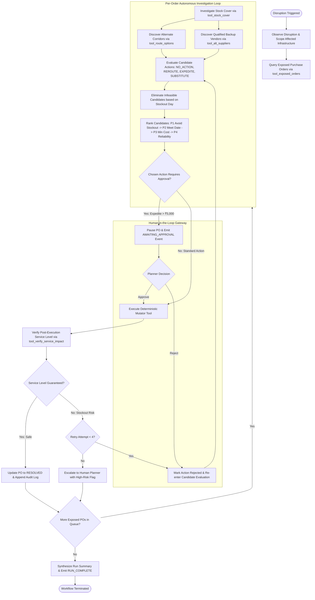

# Agent Workflow Design — Detour Command Center

**Project:** Detour — Agentic Supply-Chain Disruption Responder  
**Deployed URL:** https://motion-flow-control.lovable.app/  
**Author:** Roshan Kumar K (Roll No: 2023103536)  
**Course:** IoC — Scalable Enterprise Architectural Deployments of Agentic AI Solutions  

---

## 1. Operating Paradigm: Agent vs. Chatbot

Traditional conversational AI provides passive text advisory (e.g., *"You could consider air-shipping PO-106"*), placing the entire burden of verification, tool execution, and risk assessment on the human user.

**Detour** implements an autonomous, closed-loop agentic workflow:
$$\text{Observe} \longrightarrow \text{Investigate} \longrightarrow \text{Use Tools} \longrightarrow \text{Reason} \longrightarrow \text{Decide} \longrightarrow \text{Act} \longrightarrow \text{Verify} \longrightarrow \text{Recover / Escalate}$$

---

## 2. Detailed Agent Roles & Orchestration Pattern

Detour utilizes a centralized, deterministic **Single Orchestrator Agent** model rather than an unconstrained multi-agent swarm. In enterprise supply-chain operations, deterministic ordering, transactional atomicity, and predictability are vital.

### Orchestrator Core Responsibilities:
1. **Infrastructure Observer:** Monitors state transitions of hubs (`PORT`, `ROUTE`, `SUPPLIER`).
2. **Telemetry Investigator:** Dynamically calls read-only tools to retrieve real-time inventory, transit schedules, and supplier availability.
3. **Candidate Formulator:** Generates all valid mitigation paths across multi-modal combinations.
4. **Guardrail Enforcer:** Rejects any action that violates the fundamental invariant:
   $$\text{Arrival Day} \le \text{Stock Cover Days}$$
5. **Approval Custodian:** Pauses execution and generates interactive approval tickets when cost increments exceed established governance thresholds.
6. **Execution Engine:** Dispatches mutation tools to modify live purchase orders and routes.
7. **Verification Assessor:** Performs post-execution validation to ensure data integrity and SLA satisfaction.
8. **Forensic Reporter:** Emits structured events to the immutable audit ledger.

---

## 3. Specifications of the 8 Deterministic Backend Tools

All agent interactions with the operational database occur via 8 sandboxed tools implemented in `src/lib/agent.server.ts`:

### 3.1 `tool_exposed_orders(disruption)`
* **Type:** Read-only Discovery Tool
* **Input:** Disruption entity (`target_type`: `PORT` | `ROUTE` | `SUPPLIER`, `target_id`: UUID)
* **Logic:** Scans all open purchase orders. Identifies orders whose active transit corridor traverses the disrupted port/route, or whose origin is the shut-down vendor.
* **Output:** Array of exposed purchase orders with explicit exposure causation strings.

### 3.2 `tool_stock_cover(po)`
* **Type:** Read-only Inventory Telemetry Tool
* **Input:** Purchase order entity (`product_id`, `destination_plant`)
* **Logic:** Computes current on-hand warehouse inventory divided by daily consumption demand:
  $$\text{Stock Cover Days} = \left\lfloor \frac{\text{Current Inventory Units}}{\text{Daily Demand Rate}} \right\rfloor$$
* **Output:** Current inventory, daily demand rate, stock cover in days, calculated stockout calendar date, and initial risk tier (`LOW`, `MEDIUM`, `HIGH`).

### 3.3 `tool_alt_suppliers(product_id, quantity, exclude_supplier_id)`
* **Type:** Read-only Procurement Discovery Tool
* **Input:** Target product SKU, requested order batch size, disrupted supplier ID
* **Logic:** Queries qualified alternative suppliers from `supplier_products`. Checks operational status (`ACTIVE`) and verifies if `available_quantity >= quantity`.
* **Output:** List of viable backup suppliers including regional origin, factory lead times, unit costs, and vendor reliability scores ($0.0 - 1.0$).

### 3.4 `tool_route_options(origin, required_day, disruption)`
* **Type:** Read-only Logistics Discovery Tool
* **Input:** Origin geography, required delivery deadline, active disruption context
* **Logic:** Queries all freight routes connecting origin to Pune Plant. Filters out inactive routes and corridors passing through disrupted infrastructure.
* **Output:** Available transit corridors categorized by mode (`SEA`, `RAIL`, `AIR`, `ROAD`), transit durations, freight tariffs, and on-time reliability ratings.

### 3.5 `tool_reroute_po(po_id, route_id, disruption)`
* **Type:** State Mutator Tool
* **Input:** Purchase order ID, destination route ID, active disruption entity
* **Validation:** Re-validates that target route is active and does not connect to the disrupted port.
* **Database Action:** Updates `purchase_orders.current_route_id`, recalculates `expected_arrival`, and marks status as `REROUTED`.

### 3.6 `tool_substitute_supplier(po_id, supplier_id, route_id, disruption)`
* **Type:** State Mutator Tool
* **Input:** Purchase order ID, new supplier ID, transit route ID, disruption entity
* **Validation:** Verifies replacement supplier status, validates capacity allocation, ensures route origin matches supplier region.
* **Database Action:** Rebinds `supplier_id`, updates purchase order `unit_cost`, updates route, recalculates cumulative arrival date ($\text{Lead Days} + \text{Transit Days}$), and sets status to `SUBSTITUTED`.

### 3.7 `tool_expedite_po(po_id, route_id, disruption)`
* **Type:** State Mutator Tool
* **Input:** Purchase order ID, designated Air corridor ID, disruption entity
* **Validation:** Ensures route mode is `AIR` and corridor bypasses disrupted infrastructure.
* **Database Action:** Upgrades transport mode, commits premium freight rates, sets status to `EXPEDITED`.

### 3.8 `tool_verify_service_impact(po_id)`
* **Type:** Post-Execution Verification Tool
* **Input:** Purchase order ID
* **Logic:** Re-evaluates updated arrival date against plant stockout date and original required date:
  $$\text{Service Level} = \begin{cases} \text{STOCKOUT} & \text{if Arrival Day} > \text{Stock Cover Days} \\ \text{AT\_RISK} & \text{if Arrival Day} > \text{Required Delivery Day} \\ \text{SAFE} & \text{otherwise} \end{cases}$$
* **Output:** Service level status (`SAFE`, `AT_RISK`, `STOCKOUT`) and verified residual stockout risk.

---

## 4. Multi-Criteria Decision Policy & Ranking Matrix

For each exposed PO, Detour generates four candidate strategies:
1. `NO_ACTION`: Maintain existing carrier and wait out the disruption period.
2. `REROUTE`: Switch to an alternative surface corridor (e.g., bypass Port Meridian via Port Atlas).
3. `EXPEDITE`: Switch to high-speed dedicated Air express freight.
4. `SUBSTITUTE`: Procure batch from an alternate qualified regional supplier.

### Mathematical Ranking Function
Candidates are evaluated through a lexicographic priority ordering:
$$\text{Rank}(c) = \langle \text{Feasibility}(c), \; \text{MeetsRequired}(c), \; -\text{AdditionalCost}(c), \; \text{Reliability}(c) \rangle$$

1. **Hard Constraint (Feasibility):** Any candidate whose $\text{Arrival Day} > \text{Stock Cover Days}$ is discarded as `INFEASIBLE`.
2. **Priority 1 (Service SLA):** Candidates meeting the planner's original required date are sorted ahead of tardy arrivals.
3. **Priority 2 (Economic Cost):** Candidates meeting the SLA are ranked to minimize additional monetary expenditure.
4. **Priority 3 (Vendor/Carrier Reliability):** Between equivalent cost solutions, the option with the highest historical reliability rating is selected.

---

## 5. Human-in-the-Loop (HITL) Governance & Approvals

Enterprise autonomy requires strict financial guardrails. While low-cost routing decisions execute automatically, high-impact expenditures must pause for human authorization.

* **Expedite Approval Threshold:**
  $$\text{Incremental Cost} > ₹5,000 \implies \text{Mandatory Human Approval}$$
* **Workflow Mechanics:**
  1. If `EXPEDITE` is chosen and $\text{Cost} > ₹5,000$, the orchestrator halts execution for that specific PO.
  2. The PO status transitions to `AT_RISK` and disruption status to `AWAITING_APPROVAL`.
  3. The UI highlights the order in an interactive approval modal displaying incremental cost, delivery time delta, and alternate trade-offs.
  4. **Approval Path:** Planner clicks *Approve* $\to$ Agent completes `tool_expedite_po()` and logs the human operator's identity.
  5. **Rejection Path:** Planner clicks *Reject* $\to$ Candidate is added to the order's `excluded_candidates` list $\to$ Orchestrator immediately re-evaluates the remaining options (e.g., falling back to a secondary supplier or escalating).

---

## 6. Failure Modes, Resilience & Recovery Loops

| Failure Mode | Detection Point | Automated Recovery Pathway | Terminal Escalation |
|---|---|---|---|
| **Backup Supplier Out of Capacity** | `tool_alt_suppliers` returns insufficient inventory | Candidate filtered out before ranking; agent searches alternate transport corridors | If all suppliers lack capacity, system tests surface/air routes on existing vendor |
| **No Route Avoids Stockout** | All candidates have $\text{Arrival} > \text{Stock Cover}$ | Agent marks all candidate options as `INFEASIBLE` | Order transitions to `ESCALATED`; disruption status set to `STOCKOUT_RISK`; notification dispatched to senior planner |
| **Planner Rejects Expedite** | User rejects HITL modal | Rejected option excluded; agent re-ranks remaining feasible candidates | If no other candidate avoids stockout, order is gracefully escalated |
| **Tool Execution Failure** | Database concurrency error or route inactivation | Action marked `FAILED` in `agent_actions`; error logged; retry counter incremented | Up to 3 automatic re-evaluation attempts before fallback to human intervention |
| **AI Gateway Timeout** | HTTP timeout on LLM summarization (>6000ms) | Deterministic templated string fallback (`explain()`) executes immediately | Zero disruption to operational execution loop |

---

## 7. Primary Scenario Outcome Matrix (Port Meridian Closure)

In the benchmark 5-day closure of Port Meridian, exactly **8 Purchase Orders** are exposed, resulting in deterministic, differentiated outcomes:

| PO ID | Sourced Product | Disruption Cause | Selected Action | Key Rationale | Additional Cost | Approval Status |
|---|---|---|---|---|---|---|
| **PO-101** | Microcontrollers | Inbound Sea via Meridian | **SUBSTITUTE** | Stock covers 4 days; switch to Semico India | +₹1,200 | Auto-Executed |
| **PO-102** | Wire Harnesses | Inbound Sea via Meridian | **REROUTE** | Rerouted via Port Atlas Rail corridor | +₹800 | Auto-Executed |
| **PO-103** | Display Panels | Inbound Sea via Meridian | **REROUTE** | Rerouted via Port Atlas Coastal feeder | +₹1,450 | Auto-Executed |
| **PO-104** | Fasteners | Inbound Sea via Meridian | **NO_ACTION** | Buffer inventory covers 18 days; holds safely | ₹0 | Auto-Executed |
| **PO-105** | Power Modules | Inbound Sea via Meridian | **SUBSTITUTE** | Original supplier delayed; switch to VoltEdge | +₹2,100 | Auto-Executed |
| **PO-106** | Battery Packs | Inbound Sea via Meridian | **EXPEDITE** | Critical assembly line item; requires Air freight | +₹6,800 | **Paused for Human Approval** (Cost > ₹5k) |
| **PO-107** | Sensor ICs | Inbound Sea via Meridian | **EXPEDITE** | Air courier required; cost under threshold | +₹3,900 | Auto-Executed |
| **PO-108** | Custom Moldings | Inbound Sea via Meridian | **ESCALATE** | No backup tooling exists; transit exceeds stockout | N/A | **Escalated to Planner** |
