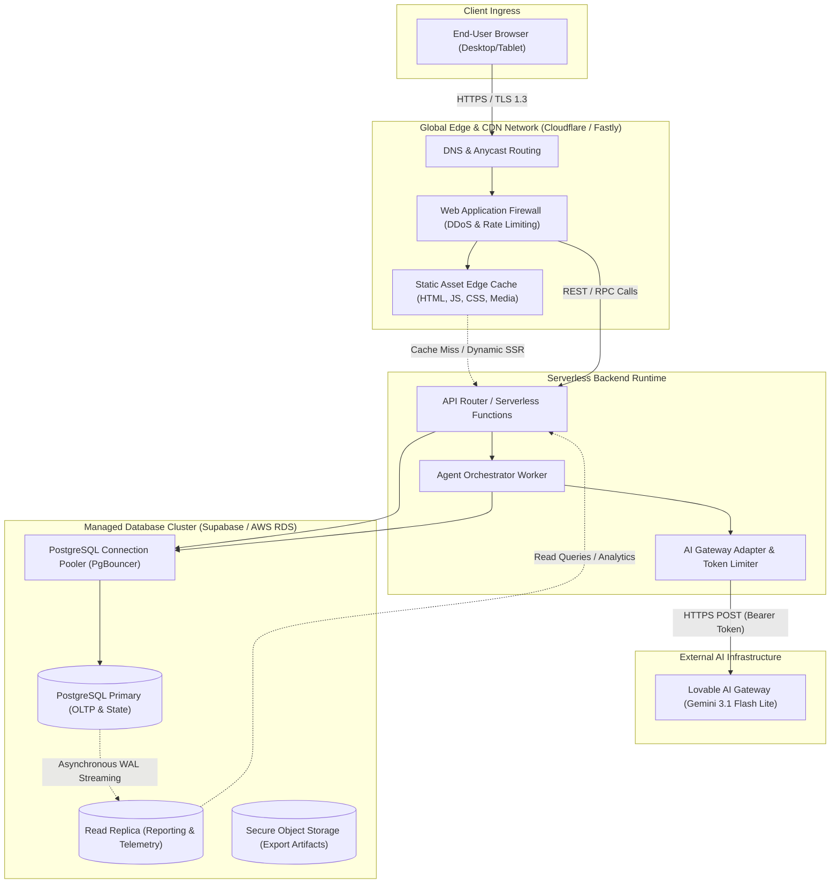

# Deployment Strategy — Detour Command Center

**Project:** Detour — Agentic Supply-Chain Disruption Responder  
**Deployed URL:** https://motion-flow-control.lovable.app/  
**Author:** Roshan Kumar K (Roll No: 2023103536)  
**Course:** IoC — Scalable Enterprise Architectural Deployments of Agentic AI Solutions  

---

## 1. Deployment Topology & Cloud Infrastructure

Detour is architected as a high-availability, modern B2B SaaS web application utilizing an edge-distributed frontend paired with serverless edge functions and a managed relational database cluster.



---

## 2. Multi-Tier Runtime Environments

To ensure operational stability, Detour follows a structured three-tier promotion lifecycle:

### 2.1 Development Environment (`Local Dev`)
* **Hosting:** Local workstation running Node.js / Bun runtime with Vite hot module replacement (HMR).
* **Database:** Local Dockerized PostgreSQL instance or dedicated Supabase staging project.
* **Data Seed:** Populated with `mockData` fixtures containing 10 suppliers, 6 ports, 15 products, 40 purchase orders, and 3 predefined disruption scenarios.
* **Secrets:** Local `.env` configuration for test database credentials and development API keys.

### 2.2 Staging & Demonstration Environment (`Demo / Staging`)
* **Hosting:** Managed Lovable containerized cloud runtime (`https://motion-flow-control.lovable.app/`).
* **Purpose:** Live evaluation, stakeholder interactive review, and capstone demonstration.
* **Characteristics:**
  - Automated continuous deployment triggered upon repository branch merges.
  - Deterministic database reset capabilities via `reset_demo()` stored procedure.
  - Integrated Lovable error reporting and telemetry monitoring.
  - Live AI Gateway connectivity using `LOVABLE_API_KEY`.

### 2.3 Enterprise Production Target (`Production Blueprint`)
* **Hosting:** AWS ECS / Fargate containerized backend instances behind an AWS Application Load Balancer (ALB), paired with Cloudflare CDN.
* **Database:** Multi-AZ AWS Aurora PostgreSQL cluster with automatic failover, read replicas, and SSL enforcement.
* **Secrets:** AWS Secrets Manager or HashiCorp Vault with automated 90-day key rotation.

---

## 3. Scalability Architecture

While the capstone demo operates over a curated dataset of 40 purchase orders, the underlying architecture is engineered to support enterprise workloads spanning tens of thousands of active shipments.

### 3.1 Stateless Presentation Layer
* The React frontend is compiled into immutable static assets (JavaScript chunks, CSS stylesheets, optimized SVGs) distributed globally across Cloudflare Anycast edge locations.
* Client-side rendering leverages virtualized table rendering (`TanStack Table` / virtual scrolling) to render thousands of purchase orders with zero frame drops.

### 3.2 Asynchronous Job Queueing for High-Volume Disruptions
When natural disasters or geopolitical events disrupt regional hubs, hundreds of purchase orders may be exposed concurrently.
* **Architecture:** The synchronous `stepRun` loop transitions to a distributed queue worker pattern (e.g., Redis / BullMQ or AWS SQS).
* **Partitioning:** Orders are partitioned by destination facility or commodity category, enabling parallel execution across isolated worker nodes without database row-locking contention.

### 3.3 Database Connection Management & Pooling
* Connection saturation is prevented via `PgBouncer` running in transaction-pooling mode.
* Frequent analytical queries (e.g., dashboard network health aggregations) are routed to read-only replicas or serviced through Redis caching with a 30-second TTL.

### 3.4 LLM Rate Limiting & Token Optimization
* **Model Selection:** Uses `google/gemini-3.1-flash-lite` for high-throughput, low-latency natural language summarization.
* **Cost Efficiency:** Prompts are restricted to under 150 tokens per order.
* **Circuit Breaker:** If token quotas are saturated or network latency spikes, the system automatically falls back to pre-compiled deterministic rule explanations (`explain()`), completely eliminating external AI dependency bottlenecks.

---

## 4. Resilience, Fault Tolerance & Disaster Recovery

| Fault Condition | Impact | Detection Mechanism | Automated Mitigation / Recovery Action |
|---|---|---|---|
| **Database Network Blip** | Intermittent query failure | Postgres transaction error caught in `one()` helper | Exponential backoff retry (3 attempts @ 100ms, 250ms, 500ms); state rollbacks |
| **External AI Gateway 5xx** | Failure of LLM natural language synthesis | HTTP status check & 6000ms `AbortController` timeout | Graceful degradation to deterministic algorithmic explanation template; zero downtime |
| **Transit Route Inactivation** | Selected candidate route disabled mid-run | `validateRoute()` runtime precondition assertion | Order execution marked `FAILED`; candidate blacklisted; agent re-executes decision matrix |
| **Client Session Disconnection** | Planner browser disconnects during active run | Heartbeat check | Run continues executing server-side; client reconnects and syncs state via `agent_runs` table |

---

## 5. Continuous Integration, Deployment & Migration Lifecycle

```mermaid
gitGraph
    commit id: "Feature Dev"
    commit id: "Local Tests Pass"
    branch staging
    checkout staging
    merge main id: "Merge to Staging"
    commit id: "Auto Deploy Lovable"
    commit id: "Run Smoke Tests"
    checkout main
    branch release
    commit id: "Tag v1.0.0"
    commit id: "Run DB Migration"
    commit id: "Canary Deploy 10%"
    commit id: "Full Rollout 100%"
```

### 5.1 CI/CD Pipeline
1. **Linting & Type Checking:** Every pull request executes `eslint` and `tsc --noEmit` to verify TypeScript strictness.
2. **Database Migration Pipeline:** Schema modifications in `supabase/migrations` are applied sequentially using declarative versioned scripts.
3. **Automated Smoke Tests:** Headless script executes `startRun('disruption_port_meridian')` and validates that all 8 exposed orders reach `RESOLVED` or `ESCALATED` states without unhandled exceptions.
4. **Zero-Downtime Deployment:** New container versions are health-checked before old pods are drained from the load balancer.
