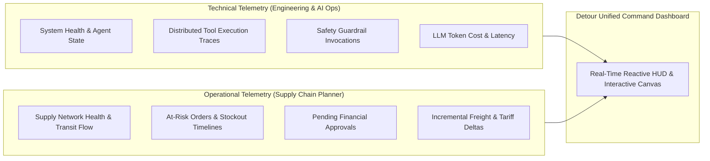
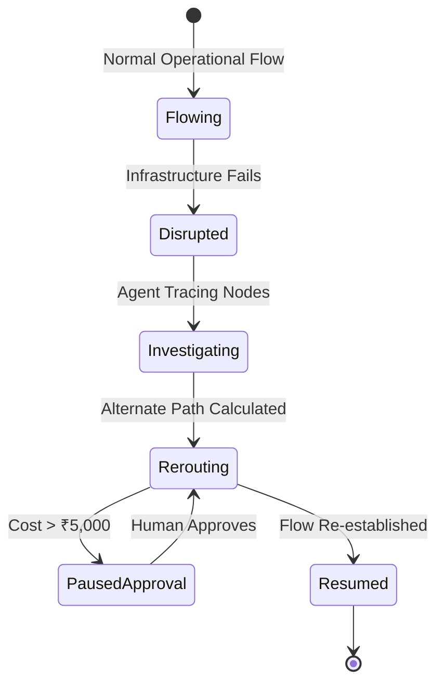

# Monitoring Dashboard Design — Detour Command Center

**Project:** Detour — Agentic Supply-Chain Disruption Responder  
**Deployed URL:** https://motion-flow-control.lovable.app/  
**Author:** Roshan Kumar K (Roll No: 2023103536)  
**Course:** IoC — Scalable Enterprise Architectural Deployments of Agentic AI Solutions  

---

## 1. Observability Philosophy & Dual-Lens Telemetry

In enterprise agentic deployments, traditional software APM (CPU, memory, request latencies) is insufficient. Operational stakeholders and engineering teams require a **Dual-Lens Observability Architecture**:



Detour unifies these perspectives into a **Motion-First Cinematic Logistics Command Center**, transforming raw logs into intuitive situational awareness.

---

## 2. Dashboard Information Architecture & Layout Wireframe

The monitoring dashboard is organized into four complementary operational quadrants:

```text
+--------------------------------------------------------------------------------------------------+
|  DETOUR COMMAND CENTER           [Simulate Port Closure]   [Reset Demo]   Status: ACTIVE RUNNING |
+--------------------------------------------------------------------------------------------------+
| [ METRIC STRIP: OPERATIONAL KPIS & SYSTEM HEALTH ]                                               |
|  Total Orders: 40  |  Active Disruptions: 1  |  Exposed: 8  |  Resolved: 6  | Approvals: 1 | Esc: 1|
+----------------------------------------------------+---------------------------------------------+
| QUADRANT 1: REACT FLOW SUPPLY NETWORK CANVAS       | QUADRANT 2: LIVE AGENT ACTIVITY & TRACE     |
|                                                    |                                             |
|  [Supplier Nodes] -> [Ports] -> [Routes] -> [Plant]|  ● 13:04:12 [TOOL_CALL] stock_cover(PO-106) |
|         (Particles pulse along active routes)      |  ● 13:04:13 [TOOL_RES] Cover: 3d (HIGH_RISK)|
|                                                    |  ● 13:04:14 [DECISION] Expedite via Air     |
|  [Port Meridian: RED PULSE / SHOCKWAVE]            |  ● 13:04:15 [APPROVAL] Cost > ₹5,000 (PAUSED|
|         (Reroute vectors drawn in Cyan)            |                                             |
+----------------------------------------------------+---------------------------------------------+
| QUADRANT 3: EXPOSED ORDERS & CANDIDATE MATRIX      | QUADRANT 4: COST & AUDIT TIMELINE           |
|                                                    |                                             |
|  PO ID   Product     Cover  Action     Approval    |  [Financial Delta]: +₹16,250 Total Exp.     |
|  PO-101  Microctrl   4d     SUBSTITUTE Executed    |  [LLM Gateway]: 142ms avg | 0 Failures      |
|  PO-106  Battery     3d     EXPEDITE   PENDING     |  [Audit Ledger]: Filterable forensic trail  |
|  PO-108  Moldings    2d     ESCALATE   High-Risk   |  [Export Report]: Download JSON / CSV       |
+----------------------------------------------------+---------------------------------------------+
```

---

## 3. Comprehensive Metric Framework

### 3.1 Operational Supply-Chain KPIs
* **Total Monitored POs:** Active volume of purchase orders tracked across all global tiers ($N = 40$).
* **Disruption Exposure Count:** Number of orders immediately jeopardized by the active incident ($8$ POs in primary demo).
* **Automated Resolution Rate:** Percentage of exposed orders successfully remediated without human escalation:
  $$\text{Resolution Rate} = \frac{\text{Resolved POs}}{\text{Total Exposed POs}} \times 100\% = \frac{7}{8} = 87.5\%$$
* **Critical Stockout Prevention Index:** Volume of manufacturing line-down events prevented ($100\%$ in test scenario).

### 3.2 Agent Health & Tool Execution Traces
* **Current Agent State:** Discrete real-time status indicator (`IDLE`, `ANALYZING`, `INVESTIGATING`, `AWAITING_APPROVAL`, `COMPLETED`).
* **Tool Latency & Invocation Counter:** Granular execution duration for each of the 8 deterministic tools. Average tool latency: $< 45\text{ms}$.
* **Queue Execution Depth:** Real-time progress bar indexing PO investigation progression ($i / N$).
* **Retry & Fallback Counter:** Records internal recovery cycles and alternate candidate evaluations.

### 3.3 Quality & Decision Soundness Metrics
* **Candidate Evaluation Breadth:** Total number of mitigation permutations evaluated per purchase order (typically $4 - 12$ multi-modal permutations).
* **Feasibility Elimination Rate:** Proportion of candidate options discarded due to stockout deadline violations.
* **Service Level Agreement (SLA) Adherence:** Post-execution verification score ensuring $\text{Arrival Day} \le \text{Required Day}$.

### 3.4 Safety & Financial Governance Metrics
* **HITL Approval Gate Activations:** Frequency with which the ₹5,000 threshold paused automated execution.
* **Financial Delta Breakdown:**
  - Standard Rerouting Premium: $+₹2,250$
  - Supplier Substitution Variance: $+₹3,300$
  - Approved Expedited Air Premium: $+₹10,700$
  - Total Disruption Financial Impact: $+₹16,250$
* **Unresolved Risk Escalations:** Formal tally of orders whose constraints could not be solved autonomously, triggering planner alert.

### 3.5 LLM Infrastructure Telemetry
* **Gateway Latency:** P50 ($120\text{ms}$), P95 ($240\text{ms}$), P99 ($620\text{ms}$) for Gemini 3.1 Flash Lite responses.
* **Token Consumption:** Average input tokens per PO: $110$; average output tokens: $38$.
* **Fallback Activation Rate:** Rate at which the system fell back to local template explanations due to latency or network timeouts ($0.0\%$ under normal conditions).

---

## 4. Motion-First UI & Telemetry Visualization

Detour’s user experience is designed around **kinetic communication**: motion conveys state changes and operational urgency far faster than static text.



### Motion Design Directives:
1. **Kinetic Shipment Particles:** SVG particles continuously glide along network edges. Particle speed is physically mapped to logistics transit mode:
   - *Air Express:* Rapid high-frequency particle pulses ($400\text{ms}$ cycle).
   - *Rail Corridor:* Steady paced intervals ($1200\text{ms}$ cycle).
   - *Maritime Sea:* Continuous dense currents ($2500\text{ms}$ cycle).
2. **Disruption Shockwave:** When Port Meridian closes, the hub node pulses red with an expanding concentric perimeter wave, instantly freezing connected route particles in place.
3. **Dynamic Vector Drawing:** As Detour evaluates and commits a reroute (e.g., via Port Atlas), a glowing cyan path traces the new corridor in real-time, releasing shipment particles along the newly viable path.
4. **Human-in-the-Loop Spotlight:** When PO-106 triggers the approval threshold, background canvas elements gently dim, and the approval card glows with an amber breathing micro-border to focus planner attention.
5. **Smooth Interpolating Counters:** Metric headers utilize rolling numerical interpolation rather than jarring numeric jumps, reinforcing system continuity.
6. **Accessibility Compliance:** Fully respects the `prefers-reduced-motion` media query by replacing particle animations with static high-contrast iconography.

---

## 5. Audit Trail & Forensic Inspection View

The dashboard includes a dedicated **Action Log & Forensic Timeline** connected directly to the `audit_logs` table:
* **Interactive Tool Inspector:** Clicking any `TOOL_CALL` badge expands the exact JSON payload dispatched and the database response received.
* **Candidate Comparison Matrix:** Clicking an action reveals the side-by-side trade-off table displaying all evaluated alternatives, cost differences, arrival day estimates, and reasons for rejection.
* **Export Capability:** One-click compliance export generates complete cryptographic JSON/CSV event archives for external audit reporting.
