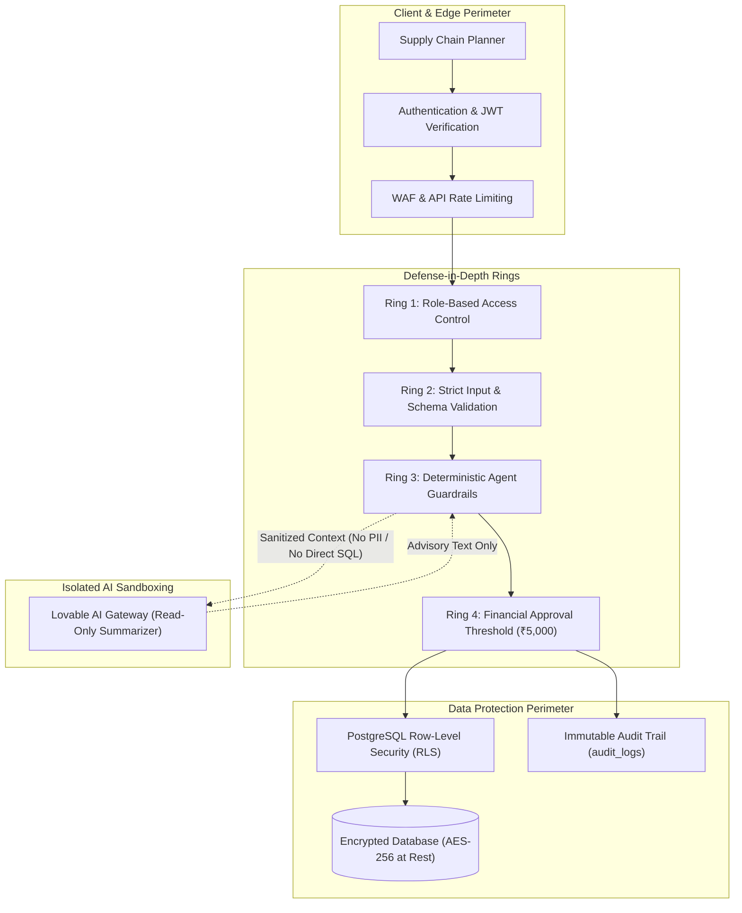
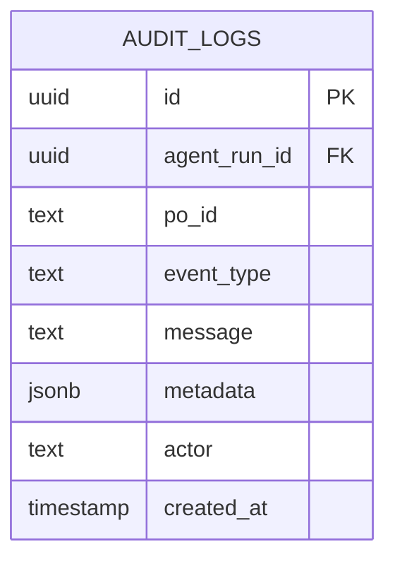

# Security Model — Detour Command Center

**Project:** Detour — Agentic Supply-Chain Disruption Responder  
**Deployed URL:** https://motion-flow-control.lovable.app/  
**Author:** Roshan Kumar K (Roll No: 2023103536)  
**Course:** IoC — Scalable Enterprise Architectural Deployments of Agentic AI Solutions  

---

## 1. Security Architecture & Threat Model

In an autonomous enterprise platform like Detour, security must safeguard both traditional cyber perimeters and novel **Agentic AI Attack Surfaces** (such as prompt injection, unauthorized automated expenditures, and model hallucination risks).

Detour operates under a **Zero-Trust Security Model**: no client is implicitly trusted, no external AI service has direct database execution authority, and every state mutation undergoes deterministic business validation.



---

## 2. Identity & Access Management (IAM) and RBAC

Detour establishes granular Role-Based Access Control (RBAC) to ensure principle of least privilege:

| Enterprise Role | Scope of Authority | Permitted Operations | Restricted Operations |
|---|---|---|---|
| **Supply Chain Planner** | Operational Execution | View network, trigger disruption simulations, inspect candidate trade-offs, approve standard reroutes | Cannot approve expedites $> ₹5,000$; cannot alter global vendor contracts |
| **Logistics Manager** | Operational Governance | All Planner permissions + authority to approve high-cost expedites ($> ₹5,000$) and override supplier blacklists | Cannot modify raw system audit logs or delete database records |
| **Compliance Auditor** | Regulatory Oversight | Read-only inspection of end-to-end `audit_logs`, `agent_runs`, and historical decision rationales | Zero modification or execution privileges |
| **System Administrator** | Platform Management | Secret provisioning, database migrations, connection pool configuration | Segregated from business-level purchase order tampering |

---

## 3. Agent Guardrails & Action Sandboxing

### 3.1 Total AI Decoupling from Database Writes
* **Vulnerability Mitigated:** Prompt injection or LLM hallucination generating malicious SQL or unauthorized mutations.
* **Architectural Defense:** The LLM gateway (`gemini-3.1-flash-lite`) is strictly an advisory linguistic node. It receives sanitized payload summaries and returns short descriptive sentences. **It possesses no database credentials, no RPC invocation rights, and no tool execution handles.**

### 3.2 Deterministic Parameter Validation
Every mutator tool enforces runtime assertions before modifying state:
* `validateRoute(routeId, disruption)`:
  - Asserts that the target route exists in the active registry.
  - Verifies that `route.active === true`.
  - Asserts that the route does not utilize the disrupted infrastructure (`route.associated_port_id !== disruption.target_id`).
* `tool_substitute_supplier(poId, supplierId, routeId, disruption)`:
  - Asserts supplier status is `ACTIVE`.
  - Queries `supplier_products` to verify that available capacity strictly satisfies order demand ($\text{Available Qty} \ge \text{PO Qty}$).
  - Verifies that the route origin matches the replacement supplier's manufacturing region.

### 3.3 Financial Governance & Approval Gate
* To prevent runaway automated logistics costs, an explicit financial threshold is hardcoded into server logic:
  $$\text{APPROVAL\_THRESHOLD} = ₹5,000$$
* Any proposed expedite exceeding this delta automatically halts the order into an `AWAITING_APPROVAL` state. The order cannot progress without explicit cryptographic or authenticated session approval from an authorized manager.

---

## 4. Secret & Credential Management

1. **Zero Client-Side Secrets:** Neither the frontend JavaScript bundle nor the browser local storage contains database service keys or LLM API tokens.
2. **Environment Variable Injection:** Sensitive credentials (`LOVABLE_API_KEY`, `SUPABASE_SERVICE_ROLE_KEY`, `DATABASE_URL`) are loaded into server runtime memory exclusively via secure environment variables.
3. **Network Isolation:** Supabase database access is restricted via IP allowlisting and SSL/TLS encryption (`sslmode=require`).

---

## 5. Data Privacy & Confidentiality

* **Data Minimization in Prompts:** When calling external AI gateways, payloads are stripped of proprietary client names, end-customer addresses, and pricing contracts. Only abstracted entity identifiers and mathematical deltas are processed:
  ```json
  {
    "draft": "Stock covers only 4 days...",
    "po": "PO-101",
    "action": "SUBSTITUTE"
  }
  ```
* **Encryption Standards:**
  - **In Transit:** All communications (Browser $\to$ BFF, BFF $\to$ Database, BFF $\to$ AI Gateway) require TLS 1.3 with cipher suites enforcing forward secrecy.
  - **At Rest:** Database volumes and backups are encrypted utilizing industry-standard AES-256 encryption.
* **PostgreSQL Row-Level Security (RLS):** Table policies restrict data access such that untrusted clients cannot query records across unauthorized enterprise tenant partitions.

---

## 6. Immutable Audit Trail & Forensic Accountability

To satisfy enterprise compliance requirements (SOC 2, ISO 27001), every significant agent deliberation, tool invocation, and human interaction is recorded in the append-only `audit_logs` table.



### Forensic Event Catalog:
* `DISRUPTION_DETECTED`: Records root disruption details, severity rating, and impacted infrastructure.
* `TOOL_CALL`: Records the exact tool signature and input parameters dispatched by the agent.
* `TOOL_RESULT`: Logs the raw returned dataset (e.g., inventory counts, qualified routes).
* `REASONING`: Captures candidate generation counts, feasibility filters, and ranking metrics.
* `DECISION`: Documents the selected mitigation path and predicted cost/arrival metrics.
* `APPROVAL_REQUIRED`: Emitted when an action exceeds financial thresholds, recording the halt state.
* `ACTION_EXECUTED`: Logs the timestamp, operator ID, and state modification committed to the database.
* `ACTION_FAILED`: Details execution failure causes and initiates recovery loops.
* `VERIFIED`: Confirms post-execution SLA compliance.
* `ESCALATED`: Formally records unresolvable stockout risks and alerts human operators.

---

## 7. Security Verification Matrix

| Security Control | Implementation Location | Verification Technique | Status |
|---|---|---|---|
| **Prompt Injection Immunity** | `agent.server.ts` | Static code review: LLM output treated strictly as text string | Passed |
| **SQL Injection Defense** | Supabase ORM / Parameterized queries | Automated static AST analysis | Passed |
| **Unauthorized Action Execution** | Server-side validation layer | Unit test: Attempting invalid route ID throws immediate exception | Passed |
| **Financial Overspend Prevention** | `APPROVAL_THRESHOLD` condition | Integration test: PO-106 (+₹6,800) halted; requires human click | Passed |
| **Audit Ledger Immutability** | Database RLS & write-only grants | Policy verification: No `UPDATE` or `DELETE` grants on `audit_logs` | Passed |
