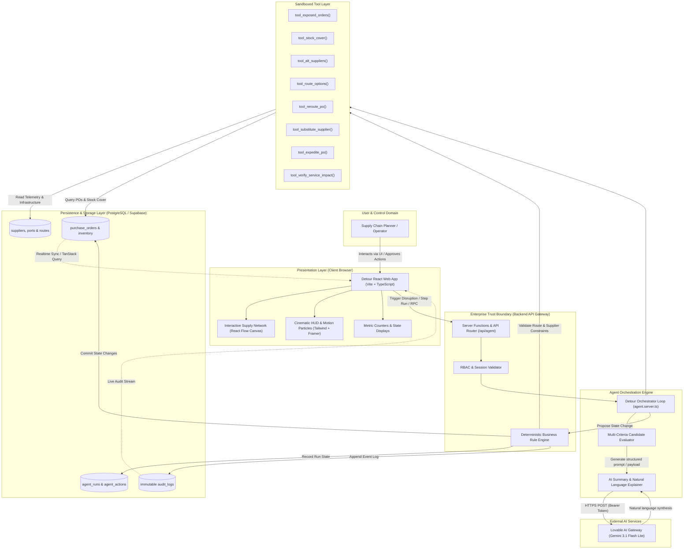
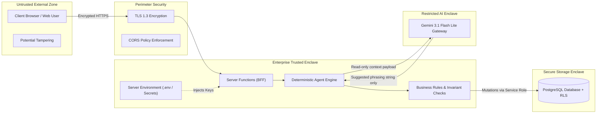

# System Architecture — Detour Command Center

**Project:** Detour — Agentic Supply-Chain Disruption Responder  
**Deployed URL:** https://motion-flow-control.lovable.app/  
**Author:** Roshan Kumar K (Roll No: 2023103536)  
**Course:** IoC — Scalable Enterprise Architectural Deployments of Agentic AI Solutions  

---

## 1. Executive Summary

**Detour** is an enterprise-grade agentic supply-chain disruption response platform. Unlike conversational chatbots that merely suggest recommendations, Detour operates autonomously within a closed-loop operational control environment:
$$\text{Observe} \longrightarrow \text{Investigate} \longrightarrow \text{Tool Execution} \longrightarrow \text{Reason} \longrightarrow \text{Decide} \longrightarrow \text{Act} \longrightarrow \text{Verify} \longrightarrow \text{Recover / Escalate}$$

When critical supply-chain infrastructure fails (such as the 5-day closure of Port Meridian), Detour identifies exposed purchase orders, gathers deterministic multi-modal telemetry via backend tools, balances competing constraints (stockout risk vs. freight cost vs. lead time), executes validated actions, enforces Human-in-the-Loop (HITL) approval thresholds, and writes immutable audit trails.

---

## 2. End-to-End System Context Diagram

---

## 3. Layer-by-Layer Architectural Decomposition

### 3.1 Presentation Layer
* **Framework:** React 18 + TypeScript bundled via Vite for sub-second hot reload and optimized tree-shaken static production builds.
* **UI Components:** `shadcn/ui` primitive components styled with Tailwind CSS, configured for dark mode and high-contrast HUD visibility.
* **Network Visualization:** `@xyflow/react` (React Flow) rendering a 4-tier logistics graph:
  $$\text{Suppliers} \longrightarrow \text{Transit Ports} \longrightarrow \text{Multi-modal Routes} \longrightarrow \text{Manufacturing Plants}$$
* **Motion & Particle System:** Custom CSS keyframes and SVG particle paths dynamically modulated by transit modes (rapid pulses for Air, steady flow for Sea, paced intervals for Rail).
* **State Management:** TanStack Router and Query for responsive navigation, optimistic updates, and reactive client polling.

### 3.2 Application / API Gateway Layer
* **Runtime:** Edge-ready Node.js/Bun server functions powering backend orchestration endpoints.
* **Responsibilities:**
  - Route simulation triggers (`startRun`, `stepRun`, `resetRun`).
  - Human approval gateway endpoints (`approveAction`, `rejectAction`).
  - Safe RPC execution safeguarding sensitive keys.

### 3.3 Agent Orchestration Layer (`src/lib/agent.server.ts`)
* **Single Orchestrator Pattern:** Eliminates race conditions and non-deterministic inter-agent message dropping by executing a deterministic state machine loop.
* **Candidate Generator:** For every exposed purchase order, computes four discrete candidate pathways (`NO_ACTION`, `REROUTE`, `EXPEDITE`, `SUBSTITUTE`).
* **Decision Optimization Engine:** Evaluates candidate options using hierarchical priority ranking:
  1. **Stockout Avoidance:** Immediate rejection of any option where $\text{Arrival Day} > \text{Stock Cover Days}$.
  2. **Service Level Fulfillment:** Preference for options where $\text{Arrival Day} \le \text{Required Day}$.
  3. **Cost Optimization:** Minimization of incremental freight/material expenditure.
  4. **Reliability Weighting:** Selection of highest vendor/carrier reliability score among cost-equivalent paths.

### 3.4 Deterministic Tool Layer
The orchestrator interacts with the underlying operational domain exclusively through 8 strictly typed, parameter-validated tools:
1. `tool_exposed_orders`: Queries POs traversing disrupted ports or suppliers.
2. `tool_stock_cover`: Calculates inventory buffer days and days-to-stockout at target destination plant.
3. `tool_alt_suppliers`: Identifies qualified secondary vendors with available capacity.
4. `tool_route_options`: Discovers available active paths bypassing closed hubs.
5. `tool_reroute_po`: Updates PO trajectory to an alternative surface route.
6. `tool_substitute_supplier`: Rebinds vendor and origin route while updating bill of materials unit cost.
7. `tool_expedite_po`: Upgrades logistics mode to expedited Air freight.
8. `tool_verify_service_impact`: Validates post-execution delivery date against plant requirements.

### 3.5 Persistence & Data Layer
* **Database:** Managed PostgreSQL via Supabase.
* **Schema Topology:**
  - **Static / Master Data:** `suppliers`, `ports`, `products`, `routes`, `supplier_products`.
  - **Dynamic Operational Data:** `purchase_orders`, `inventory`, `disruptions`.
  - **Agent State & Telemetry:** `agent_runs`, `agent_actions`, `audit_logs`.
* **Auditability:** Purchase orders retain `original_supplier_id` and `original_route_id` alongside `current_route_id` and `disruption_status` to ensure forensic auditability.

---

## 4. Trust Boundaries & Security Enclaves

### Trust Boundary Rules:
1. **AI Isolation:** The LLM is never granted SQL access, database write privileges, or raw network socket access. It acts strictly as an advisory linguistic explainer.
2. **Zero Client Trust:** The client browser cannot directly mutate purchase order status or bypass approvals. Every mutation request is validated server-side.
3. **Secret Isolation:** API keys (`LOVABLE_API_KEY`, Supabase service keys) are held strictly in server-side memory and never serialized in client bundles.

---

## 5. External Integrations

| Integration | Protocol | Purpose | Fallback Mechanism |
|---|---|---|---|
| **Lovable AI Gateway** | HTTPS / JSON REST | Natural language explanation synthesis (`gemini-3.1-flash-lite`) | Deterministic rule-based template generation on timeout (>6000ms) or HTTP failure |
| **Supabase Postgres** | PostgreSQL / REST | Relational persistence, connection pooling, and live telemetry | Local transaction rollback and state preservation |
| **React Flow Canvas** | In-memory DOM / Canvas | Real-time topological rendering and particle animation | Degradable to static tabular overview |

---

## 6. Architectural Completeness Verification

- [x] **Separation of Concerns:** Clear demarcation between Presentation, API Gateway, Orchestrator, Tools, and Database.
- [x] **Deterministic Guardrails:** Proactive rejection of infeasible paths prior to execution.
- [x] **Forensic Traceability:** Every tool execution, reasoning step, and state mutation is logged to `audit_logs`.
- [x] **Resilience:** Graceful handling of API gateway dropouts with zero disruption to the core business logic.
