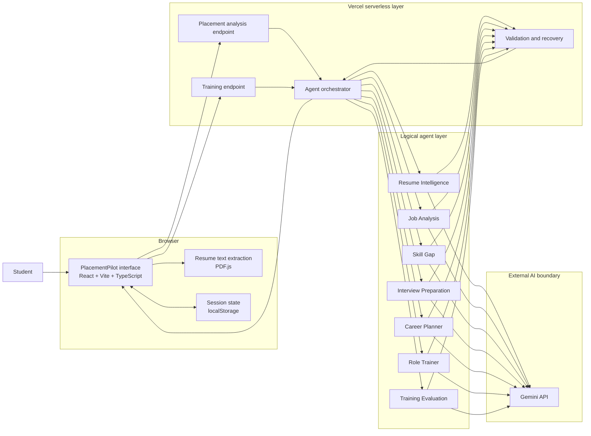
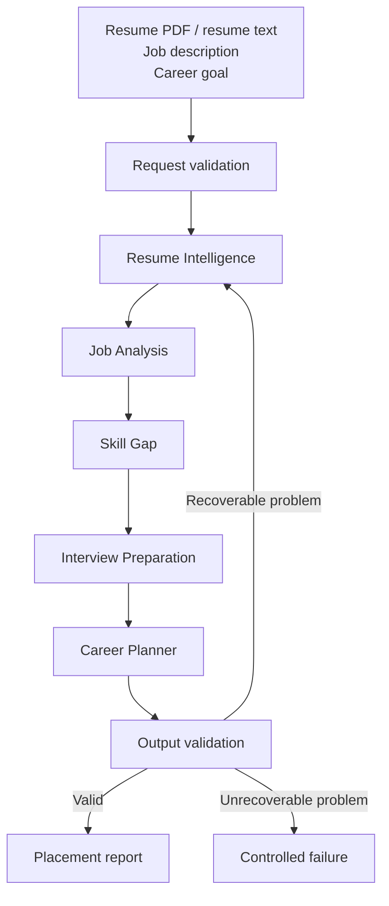
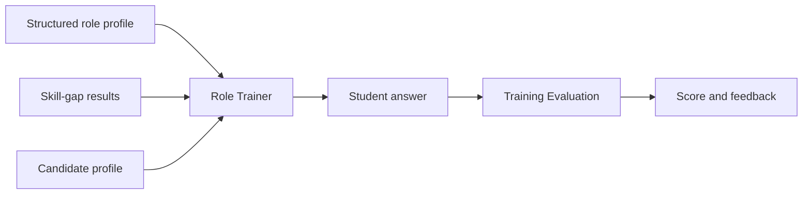

# 1. Architecture Diagram

## PlacementPilot — Capstone Deliverable 1

### 1.1 What this document explains

PlacementPilot is a web application that helps a student understand a target job and prepare for it. The student provides a resume, a job description, and a career goal. The application then coordinates several specialised AI stages to turn that information into a placement report, preparation priorities, interview questions, a short preparation plan, and role-specific training.

The system is intentionally lightweight. There is no database and there is no permanently running application server. The browser keeps short-term session information, while the serverless layer handles requests that need the AI provider.

The architecture therefore has three important boundaries:

1. The student's browser, where the user interacts with the product and where resume text can be extracted locally.
2. The serverless application layer, where requests are validated and the agent workflow is coordinated.
3. The external model provider, Gemini, which is used for language understanding and generation.

### 1.2 High-level architecture



### 1.3 How the layers work

#### Presentation layer

The front end is built with React, Vite, and TypeScript. It is presented as a single guided page rather than a permanent sidebar dashboard. The student moves from the initial profile and job inputs into placement analytics, role intelligence, preparation priorities, example questions, role training, and mock interview.

The project documentation describes this as a continuous placement journey with a compact progress indicator and Continue or Skip controls. fileciteturn3file5L27-L34

#### Local document handling

A resume PDF can be converted into text in the browser using PDF.js. This keeps the document-reading step close to the user and avoids creating a separate document-processing service.

The extracted text is then passed into the placement workflow.

#### Serverless application layer

The serverless layer receives the browser request, validates it, and invokes the appropriate workflow. Two broad operations are important:

- placement analysis
- role training and answer evaluation

This layer is intentionally short-lived. It does not maintain an application session between requests.

#### Agent layer

The application treats each stage as a specialised logical agent. The roles are separated so each stage has a clear responsibility and structured output.

| Agent | Main responsibility |
|---|---|
| Resume Intelligence Agent | Turns resume text into a structured candidate profile. |
| Job Analysis Agent | Turns the job description into a structured role profile. |
| Skill Gap Agent | Compares the candidate profile with the role. |
| Interview Preparation Agent | Produces realistic interview areas and example questions. |
| Career Planner Agent | Converts the gaps into a practical preparation plan. |
| Role Trainer Agent | Creates job-specific practice questions. |
| Training Evaluation Agent | Evaluates submitted answers and returns structured feedback. |

The current project documentation describes these logical agents and their responsibilities. fileciteturn9file0L1-L2

#### External AI layer

Gemini is outside the application's trust boundary. The model is called from server-side execution so the provider credential is not placed in the browser bundle.

The project's README identifies Gemini as the external AI provider and `GEMINI_API_KEY` as a server-side configuration value. fileciteturn3file4L24-L31

### 1.4 Main data flow

The normal placement-analysis path is:



The role trainer follows a second path:



### 1.5 Trust boundaries

The system has clear boundaries between data and execution environments.

```text
Boundary 1 — Browser
  Untrusted user and document content
        |
        | HTTPS
        v
Boundary 2 — Serverless application
  Request validation
  Workflow coordination
  Secret access
        |
        | Secure provider request
        v
Boundary 3 — Gemini
  External model processing
```

The browser is not treated as trusted simply because it is part of the application. A resume, job description, or interview answer can contain arbitrary text.

The serverless layer is the controlled part of the application. It is responsible for keeping provider credentials private and checking that requests and model responses have the expected structure.

### 1.6 Why the architecture is stateless

The current project intentionally avoids a database. Session history is kept in browser storage, while the serverless runtime remains ephemeral. This reduces deployment complexity and removes the need for database credentials, migrations, backup policies, and long-lived application servers.

The project README explicitly describes the architecture as stateless and says that short-term session history is kept in `localStorage`. fileciteturn3file4L20-L30

This is appropriate for the current capstone scope. It also gives a clear boundary for future work: if PlacementPilot later needs accounts, long-term histories, recruiter views, or multi-device progress, a persistent data layer would need to be introduced.

### 1.7 Technology view

| Area | Technology | Why it is used |
|---|---|---|
| User interface | React | Component-based application interface |
| Build tooling | Vite | Fast development and production build |
| Language | TypeScript | Static typing and safer application code |
| PDF handling | PDF.js | Local extraction of text from uploaded resumes |
| Server runtime | Vercel serverless functions | Server-side execution without maintaining a long-running server |
| AI provider | Gemini | Resume analysis, role analysis, question generation and evaluation |
| Client persistence | `localStorage` | Short-term session history |
| Source control | GitHub | Version control and deployment trigger |

The project's package and README identify the same core stack. fileciteturn3file3L2-L32 fileciteturn3file4L24-L31

### 1.8 Architectural characteristics

**Stateless backend:** requests can be handled independently.

**Clear trust boundaries:** the browser, serverless runtime, and external model are treated as different environments.

**Specialised reasoning stages:** each logical agent has one clear job instead of relying on one large prompt.

**Structured outputs:** downstream stages consume structured information rather than parsing arbitrary prose.

**Low infrastructure overhead:** there is no database or continuously running backend server.

### 1.9 What to show during the capstone presentation

A good explanation is:

> “PlacementPilot separates the user interface, the serverless application layer, the agent workflow, and the external AI provider. The browser handles the user journey and local resume extraction. The serverless layer protects the provider credential and coordinates the agents. Each agent has a specialised responsibility, and the result is validated before it is returned to the user.”

This is much easier to understand than describing PlacementPilot as simply “a chatbot with multiple prompts.”
