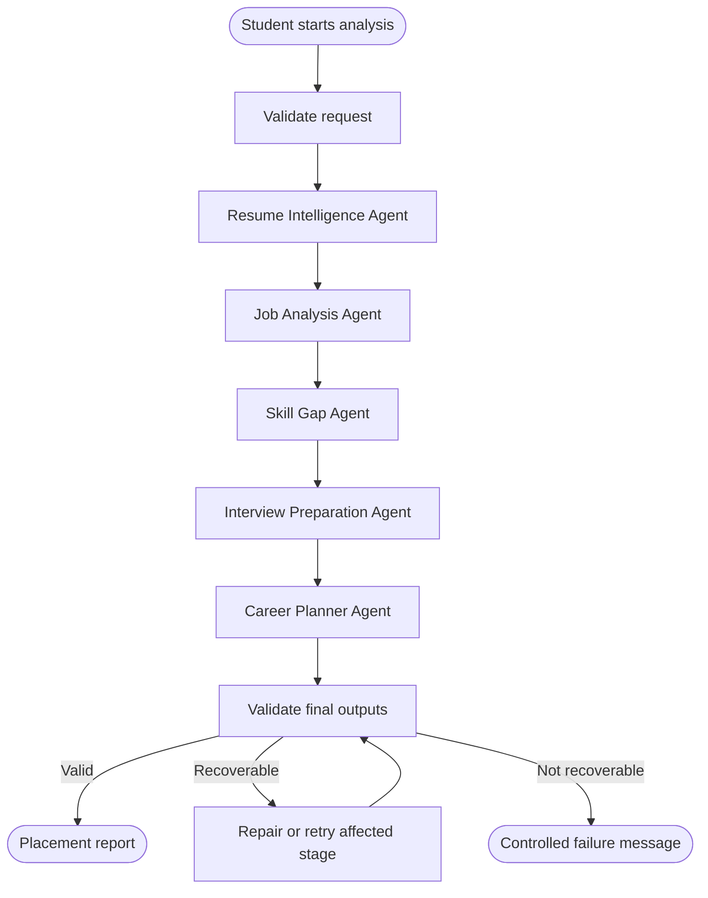
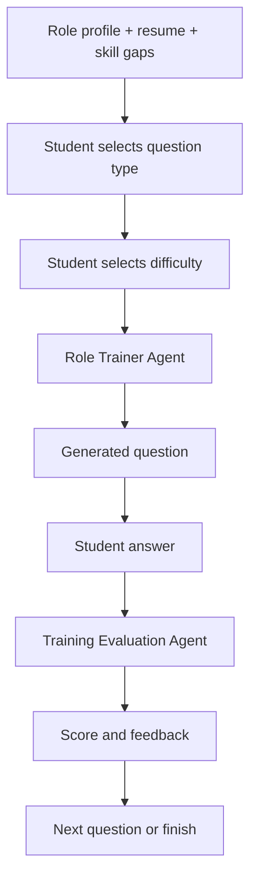
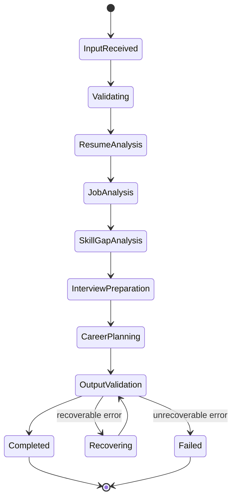
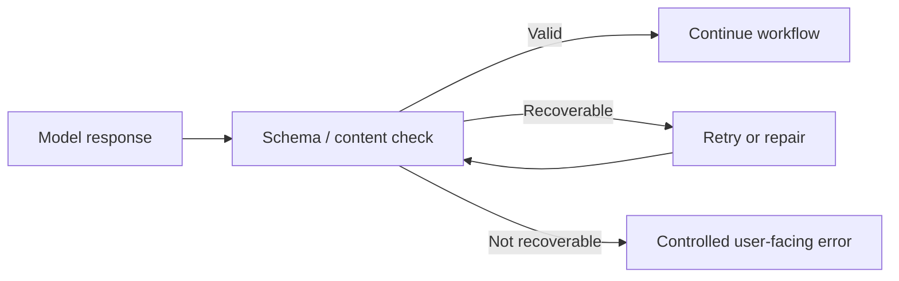

# 2. Agent Workflow Design

## PlacementPilot — Capstone Deliverable 2

### 2.1 The idea behind the workflow

PlacementPilot is designed as a coordinated workflow rather than a single prompt sent to an AI model.

The student starts with three pieces of information:

- a resume
- a target job description
- a career goal

The system breaks the job into smaller reasoning tasks. Each stage produces a structured result that becomes context for the next stage.

This separation makes the process easier to understand, validate, monitor, and explain.

### 2.2 Placement intelligence workflow



### 2.3 Why the stages are separated

A resume and a job description are different kinds of documents. Asking one model call to perform everything at once makes the system harder to reason about.

PlacementPilot therefore separates the process.

#### Resume Intelligence Agent

Its job is to understand the candidate.

It extracts information such as education, experience, technical skills, projects, certifications, and supporting evidence.

Its output answers:

> “What do we actually know about this candidate?”

#### Job Analysis Agent

Its job is to understand the employer's requirement.

It extracts the role, responsibilities, required skills, preferred skills, technologies, and signals about likely interview or assessment areas.

Its output answers:

> “What does this role appear to require?”

#### Skill Gap Agent

It compares the two structured profiles.

Its output identifies:

- skills that already match
- partial matches
- missing skills
- high-priority areas to prepare

This is the bridge between analysis and action.

#### Interview Preparation Agent

It turns the job requirements and gaps into realistic preparation material.

It can identify areas such as:

- technical concepts
- coding
- project discussions
- behavioural questions
- system design

and provide representative questions.

#### Career Planner Agent

It converts the findings into a practical preparation sequence.

The project tests the end-to-end workflow and checks that the generated preparation plan contains seven days. fileciteturn3file7L35-L45

### 2.4 Role-training workflow

The application also supports a separate training loop after the main analysis.



The supported training categories documented by the project are:

| Mode | Purpose |
|---|---|
| Multiple choice | Fast concept checking |
| Coding | Problem-solving practice |
| Technical | Role-specific technical discussion |
| Behavioural | Communication and experience-based preparation |
| Project | Questions grounded in the student's own work |
| System design | Architecture and design thinking |
| Case / debugging | Practical troubleshooting and reasoning |

The important part is that the trainer does not start from a generic question bank. It receives the structured role profile and skill-gap information, so the question can be grounded in the target opportunity.

### 2.5 Handoffs between agents

The workflow can be understood as a chain of structured handoffs:

```text
Resume Intelligence
        |
        | candidate profile
        v
Job Analysis
        |
        | role profile
        v
Skill Gap
        |
        | strengths + gaps + priorities
        v
Interview Preparation
        |
        | questions + interview areas
        v
Career Planner
        |
        | preparation sequence
        v
Validated placement report
```

This is one of the strongest parts of the architecture because each step has a reason for existing.

### 2.6 State model

The workflow can be described with the following states:



The same pattern is useful for training:

```text
Training setup
      |
      v
Question generation
      |
      v
Question shown
      |
      v
Answer submitted
      |
      v
Evaluation
      |
      +----> Next question
      |
      +----> Session complete
```

### 2.7 Validation and failure handling

A reliable agent workflow must assume that an AI model can return incomplete or malformed information.

The validation layer therefore checks whether a response has the structure expected by the application before the next stage consumes it.

A simple recovery path is:



This is safer than blindly passing free-form model text from one stage to another.

### 2.8 What the user experiences

The user does not need to understand the internal agent sequence to use PlacementPilot.

The visible journey is:

```text
Enter profile information
        |
        v
Analyze target role
        |
        v
See readiness and skill gaps
        |
        v
Understand what to focus on
        |
        v
See realistic interview questions
        |
        v
Take a role-specific mock test
        |
        v
Complete a mock interview
```

The internal execution trace is available as a monitoring surface, so the product can remain simple for the student while still being explainable to an evaluator.

### 2.9 What is genuinely agentic about the design

The agentic behavior is not just the use of an AI model.

The important elements are:

1. The overall placement task is decomposed into distinct reasoning stages.
2. Each stage has a defined role and expected output.
3. Outputs from earlier stages are used as context for later stages.
4. The workflow has validation and recovery states.
5. A second workflow can generate and evaluate role-specific practice questions.
6. The user can move from analysis to action instead of receiving a one-off answer.

That is the key story to explain in the capstone presentation.

### 2.10 Evidence in the current project

The project includes an end-to-end workflow test that checks that the resume result, job result, skill-gap result, interview result, career plan, and agent run are all present and that the agent run completes successfully. fileciteturn3file7L35-L45

The submission documentation also recommends demonstrating the agent trace, changing training modes, and explaining that the trainer uses the structured job profile and skill-gap output as context. fileciteturn3file6L41-L47
