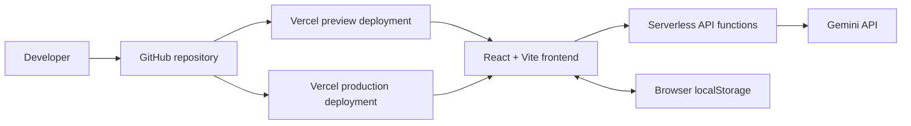
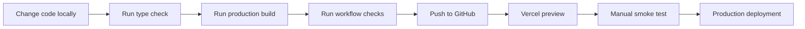
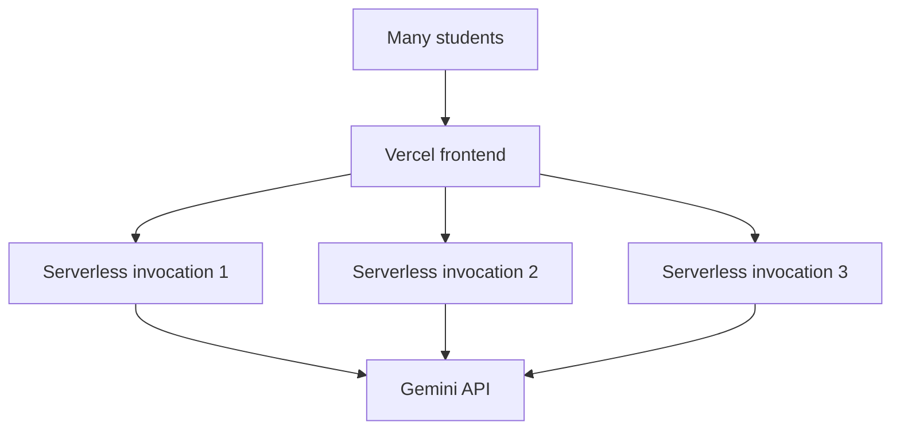

# 3. Deployment Strategy

## PlacementPilot — Capstone Deliverable 3

### 3.1 Deployment goal

PlacementPilot is designed to be easy to deploy and easy to reproduce.

The application does not require a database or a long-running backend server. Instead:

- the React application is built and served through Vercel
- server-side requests run as Vercel serverless functions
- Gemini is used as the external AI provider
- short-term session information remains in the browser

This keeps the deployment small enough for a course project while still giving the application a real public URL.

### 3.2 Deployment architecture



### 3.3 Environments

#### Local development

The local application runs a Vite development server together with the local API runtime.

The project provides:

```powershell
npm install
npm run dev:full
```

The package scripts explicitly define the combined local development flow. fileciteturn3file3L6-L14

Local development is where the complete workflow should first be tested because errors can be inspected directly from the terminal.

#### Preview environment

A preview deployment is useful when a feature is being changed but should not immediately become the live version.

Typical preview checks include:

- the page loads correctly
- environment variables are available
- the API function can be reached
- the AI provider responds correctly
- the complete placement workflow finishes
- role training still works
- the UI is responsive

#### Production environment

Production is the stable public version of PlacementPilot.

The production environment needs the server-side AI provider credential and the same build that has already passed local and preview testing.

### 3.4 Release flow



This gives the project a simple release discipline:

> do not deploy first and test later; test the build and workflow before promoting it.

### 3.5 Build process

The project uses:

```bash
npm run build
```

The package configuration runs TypeScript's build check before the Vite production build. fileciteturn3file3L10-L14

The root Vercel configuration also declares serverless functions under the `api` path and sets their maximum execution duration. fileciteturn3file11L1-L9

### 3.6 Configuration and secrets

The AI provider credential belongs only on the server side.

A conceptual production environment looks like:

```text
GEMINI_API_KEY=<secret>
GEMINI_MODEL=<configured model>
```

The key should never be written into frontend code or exposed through a `VITE_` variable.

The repository's ignore rules exclude `.env`, `.env.*`, `.vercel`, `dist`, and `node_modules`. fileciteturn8file2L1-L8

### 3.7 Why the architecture is stateless

There is no database in the current design.

That gives several practical benefits:

- no database provisioning
- no migration process
- fewer production credentials
- simpler deployment
- easier reproduction of the assignment
- fewer infrastructure components to maintain

The trade-off is that the application does not retain long-term student history on the server.

The current project documentation explicitly identifies browser storage as the place where short-term session history is kept. fileciteturn10file2L20-L31

### 3.8 Scaling and resilience

The application can scale horizontally because the backend work is handled by stateless serverless functions rather than one shared application process.

A useful mental model is:



The main scaling constraints therefore move away from server capacity and toward:

- model provider quotas
- provider latency
- serverless execution limits
- request size
- concurrent AI requests

The current deployment design documents the same scaling considerations. fileciteturn10file0L62-L75

### 3.9 Failure handling

A production deployment needs to handle failures at several levels.

| Failure | Expected handling |
|---|---|
| Invalid request | Return a controlled client error |
| AI provider authentication failure | Surface a safe configuration error |
| AI provider quota or rate limit | Controlled error and retry strategy where appropriate |
| Model returns invalid structure | Validate and repair or retry |
| Function timeout | Stop the run and return a controlled message |
| Frontend network error | Show a retry option |
| Unsupported resume file | Ask the user for a supported file |

The goal is not to hide failures. The goal is to fail in a way that is understandable and recoverable.

### 3.10 Production verification checklist

Before submitting the deployed URL, test:

```text
Application opens
       |
       v
Resume upload works
       |
       v
Job description is accepted
       |
       v
Placement analysis completes
       |
       v
Role Intelligence renders
       |
       v
Skill gaps render
       |
       v
Training question generates
       |
       v
Answer evaluation completes
       |
       v
Mock interview is reachable
```

Also verify that the Gemini key is not visible in browser source, network payloads, or frontend environment variables.

### 3.11 Deployment summary

PlacementPilot deliberately uses a small deployment footprint:

```text
GitHub
   |
   v
Vercel
   |----------------------|
   v                      v
React frontend       Serverless APIs
                           |
                           v
                       Gemini

Browser
   |
   +---- localStorage
```

The result is a publicly accessible AI application without the operational overhead of a database or dedicated backend server.
