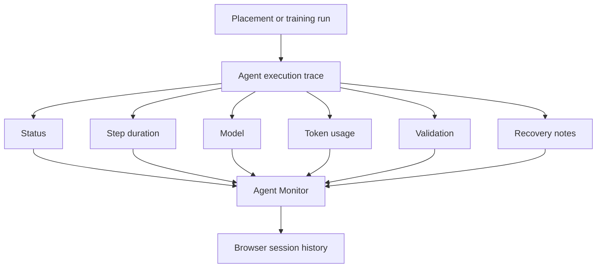
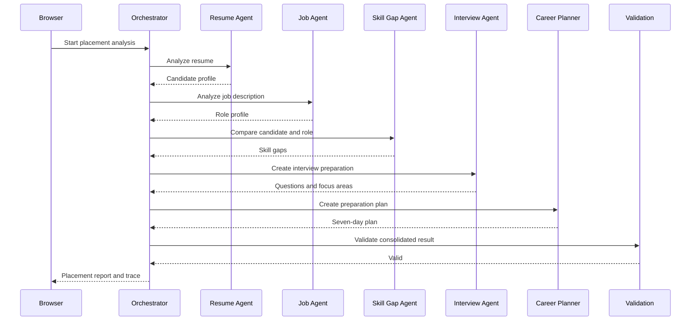
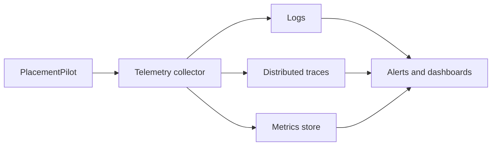

# 5. Monitoring Dashboard Design

## PlacementPilot — Capstone Deliverable 5

### 5.1 Why monitoring matters

PlacementPilot does not stop at generating an answer. It runs a sequence of AI-backed stages, and each stage can succeed, fail, take a different amount of time, or require recovery.

Monitoring helps answer four simple questions:

1. Did the workflow finish?
2. Which stage took the most time?
3. Did the model return valid information?
4. If something failed, where did it fail?

The current architecture is stateless, so the main monitoring surface is the live agent execution trace. Short-term session information can also remain in browser storage. The project documentation explicitly identifies this live trace approach and notes that persistent centralized telemetry is not part of the current architecture. fileciteturn9file1L1-L2

### 5.2 Monitoring architecture



### 5.3 What the dashboard should look like

The monitor should feel like a professional operations view, but it does not need to become a giant enterprise command centre.

A simple structure is enough:

```text
PLACEMENT RUN
Run ID: RUN-2026-001
Status: Completed
Duration: 8.4 seconds

------------------------------------------------

Agent execution

✓ Resume Intelligence        1.10 s
✓ Job Analysis               0.95 s
✓ Skill Gap                  1.72 s
✓ Interview Preparation      2.10 s
✓ Career Planner             1.46 s
✓ Validation                 0.32 s

------------------------------------------------

Model usage

Model: configured provider model
Requests: 6
Tokens: available when returned by provider

------------------------------------------------

Quality

Validation: Passed
Recovery events: 0
Workflow result: Completed
```

### 5.4 Agent execution trace

The trace is the most useful monitoring feature because it explains what the application actually did.

A typical placement run can be shown as:



This is helpful during the capstone demonstration because it makes the multi-agent workflow visible.

### 5.5 Metrics

#### Application health

These answer whether the application is functioning.

| Metric | What it tells us |
|---|---|
| Successful requests | How often a workflow finishes normally |
| Failed requests | How often the application returns an error |
| Timeout count | How often execution takes longer than allowed |
| End-to-end latency | How long the complete request takes |

#### Workflow performance

These answer where time is being spent.

| Metric | What it tells us |
|---|---|
| Agent step count | How many stages were executed |
| Step duration | Which stage is slow |
| Recovery count | How often a stage needs another attempt |
| Workflow status | Whether the run is active, complete, recovering, or failed |

#### Output quality

These help measure the reliability of model-generated data.

| Metric | What it tells us |
|---|---|
| Validation success rate | Whether responses have the expected structure |
| Repair or retry rate | How often model output needs recovery |
| Evaluation completeness | Whether training feedback contains all required fields |

#### Safety signals

These can be added as the security model grows.

| Metric | What it tells us |
|---|---|
| Rejected inputs | How many requests fail input validation |
| Provider errors | Authentication, quota, or provider failures |
| Rate-limit events | How many requests were throttled |
| Prompt-injection test results | Whether known malicious patterns are detected or handled |

#### Usage and cost

Where the AI provider returns token information, record:

- input tokens
- output tokens
- total tokens
- number of model calls
- estimated cost

If the provider does not return reliable cost information, show “unavailable” instead of inventing a number.

### 5.6 Product outcomes

The technical dashboard can also track simple product events:

```text
Placement analyses completed
        |
        +----> Skill-gap reports generated
        |
        +----> Mock tests started
        |
        +----> Questions answered
        |
        +----> Mock interviews started
        |
        +----> Preparation plans generated
```

These are product-usage measurements. They should not be described as evidence that a student will get a job.

### 5.7 Monitoring in the current architecture

The current project already has a live execution trace with information such as status, latency, model, token count, validation and recovery notes. fileciteturn9file1L1-L2

The submission documentation also identifies the live trace and those execution details as a monitoring proof point during evaluation. fileciteturn3file6L13-L20

Because the application is stateless, this information is primarily useful for the current run and browser session.

### 5.8 What is not yet persistent

There is an important difference between “the application can show a run” and “the organisation has long-term observability.”

The current project does not provide a central telemetry store for:

- all runs across all users
- historical failure trends
- long-term model-quality analysis
- historical cost reporting
- central security-event history

That is not a mistake in the current capstone architecture. It is the result of the deliberate decision not to introduce a database.

### 5.9 Future enterprise monitoring design

If PlacementPilot were expanded beyond the capstone, a central telemetry service could store:



That future layer would make it possible to compare versions, detect regressions, analyse provider costs, and investigate incidents over time.

### 5.10 What to demonstrate during evaluation

A clear live demonstration is:

1. Start a placement run.
2. Open the agent monitor.
3. Point to each completed agent stage.
4. Show its duration.
5. Show the validation result.
6. Explain what happens if a stage fails.
7. Start role training.
8. Show the second workflow and answer evaluation.

The message to the evaluator is:

> “The system does not hide the agent workflow. Every important stage has an observable status, and the monitoring surface tells us whether the run succeeded, how long it took, and whether recovery was needed.”
