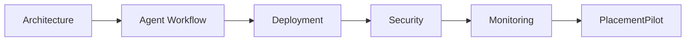

# PlacementPilot Capstone Deliverables

These documents cover the five capstone artifacts requested for the agentic AI architecture assignment.

The writing is intentionally straightforward so that someone reading the repository can understand the system without already knowing how PlacementPilot was built.

## The five deliverables

| Document | Purpose |
|---|---|
| `01_ARCHITECTURE_DIAGRAM.md` | Explains the system layers, components, data flow, and trust boundaries. |
| `02_AGENT_WORKFLOW_DESIGN.md` | Explains the agents, their responsibilities, handoffs, validation, and recovery paths. |
| `03_DEPLOYMENT_STRATEGY.md` | Explains local, preview, and production deployment through GitHub and Vercel. |
| `04_SECURITY_MODEL.md` | Explains secrets, privacy, trust boundaries, validation, prompt-injection protection, and current limitations. |
| `05_MONITORING_DASHBOARD_DESIGN.md` | Explains the live agent trace, health metrics, quality metrics, safety signals, and future observability. |

## How the five documents fit together



The first document explains **what exists**.

The second explains **how the agents work together**.

The third explains **how the application is run and released**.

The fourth explains **how the system is protected**.

The fifth explains **how the system can be observed and evaluated**.

## Current project context

PlacementPilot is a stateless multi-agent placement-preparation assistant.

A student provides:

- a resume
- a target job description
- a career goal

The application produces:

- structured resume intelligence
- target-role analysis
- skill-gap analysis
- interview preparation
- a seven-day preparation plan
- role-specific training
- answer evaluation
- a visible agent execution trace

The current product does not use a database. Short-term browser session information is kept in `localStorage`, while AI-backed requests are handled through serverless functions. fileciteturn3file4L1-L31

## Repository placement

For the course repository, the recommended location is:

```text
submissions/
└── Aadhisesha/
    └── PlacementPilot/
        ├── src/
        ├── api/
        ├── server/
        ├── public/
        ├── docs/
        │   └── capstone/
        │       ├── 01_ARCHITECTURE_DIAGRAM.md
        │       ├── 02_AGENT_WORKFLOW_DESIGN.md
        │       ├── 03_DEPLOYMENT_STRATEGY.md
        │       ├── 04_SECURITY_MODEL.md
        │       └── 05_MONITORING_DASHBOARD_DESIGN.md
        ├── README.md
        ├── SUBMISSION.md
        └── ...
```

## A note about the diagrams

Each document contains Mermaid diagrams directly in the Markdown. GitHub can render Mermaid diagrams, so the architecture and workflow can be understood without opening a separate drawing application.

The diagrams are intentionally simple. They show the important relationships rather than trying to turn every implementation detail into a box.

## What to say during the capstone presentation

A simple explanation is:

> PlacementPilot takes a student's resume and a target job description, uses a coordinated set of AI agents to compare the two, identifies the preparation gaps, and then turns those findings into interview questions, training, and a preparation plan. The application runs as a stateless web application, keeps the model credential on the server side, and exposes the agent execution trace so the workflow can be inspected.

Then use the five documents in order:

**Architecture → Workflow → Deployment → Security → Monitoring**

That sequence tells one continuous story from system design to operation.

## Scope note

The current application intentionally does not implement persistent accounts, a database, or central long-term telemetry. These are documented as design boundaries rather than hidden limitations.

Any future enterprise expansion that adds multi-user history, persistent audit records, or historical monitoring would require additional infrastructure.
