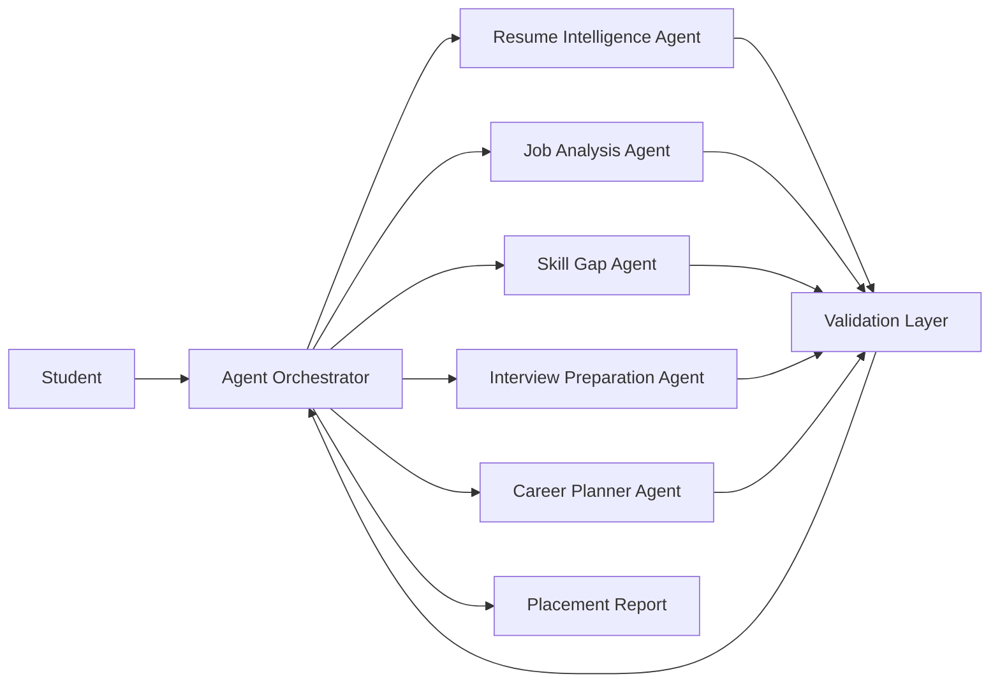
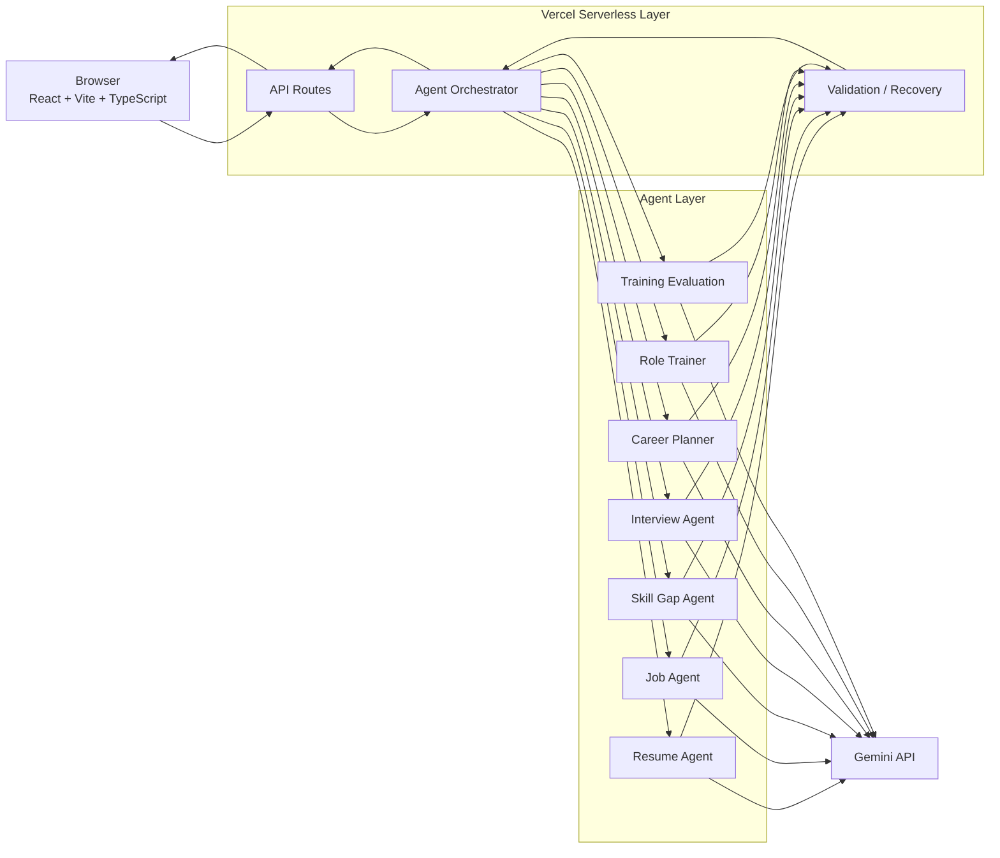

# PlacementPilot — Agentic Career Preparation Assistant

**Student Name:** Aadhisehsa D  
**Roll No:** 2023103554  
**Course:** IoC — Scalable Enterprise Architectural Deployments of Agentic AI Solutions  
**Live Deployed Application:** [https://placement-pilot-lake.vercel.app/](https://placement-pilot-lake.vercel.app/)

---

## 📌 Project Overview

**PlacementPilot** is a stateless, multi-agent AI career preparation assistant designed to help students prepare for technical placements.

The application starts with a student's **resume**, a **target job description**, and an optional **career goal**. PlacementPilot then analyses the relationship between the candidate and the target role and turns that analysis into a guided preparation journey.

Instead of giving the student one generic AI response, the application separates the task into specialised stages:

```text
Resume
   +
Job Description
   +
Career Goal
        |
        v
Agent Orchestrator
        |
        +--------------------+
        |                    |
        v                    v
Resume Intelligence      Job Analysis
        |                    |
        +---------+----------+
                  |
                  v
             Skill Gap
                  |
                  v
        Interview Preparation
                  |
                  v
           Career Planner
                  |
                  v
             Validation
                  |
                  v
        Placement Intelligence
                  |
        +---------+----------+
        |                    |
        v                    v
   Role Trainer        Mock Interview
        |
        v
Training Evaluation
```

The result is a guided workflow that helps a student understand:

- what the target role expects
- how their current profile compares
- which skills need more preparation
- which interview areas are likely to matter
- what questions they should practise
- how they perform in a role-specific mock test
- how they perform in a mock interview
- what they should focus on next

---

## 🌟 Key Features

### 1. Resume Intelligence

Upload a resume in PDF format and PlacementPilot extracts the available text locally before sending the relevant information into the analysis workflow.

The Resume Intelligence stage identifies information such as:

- education
- experience
- technical skills
- frameworks
- tools
- projects
- certifications
- supporting evidence from the resume

The system is designed to use the resume as source information rather than inventing candidate details.

---

### 2. Target Role Intelligence

Paste a real job description and PlacementPilot analyses what the role requires.

The Job Analysis stage identifies:

- role title
- company information when available
- responsibilities
- required skills
- preferred skills
- technologies
- soft skills
- likely assessment areas
- likely interview rounds
- preparation priorities

This goes beyond simply extracting a list of technologies. The objective is to understand **how a student is likely to be assessed for the role**.

---

### 3. Personal Placement Analytics

PlacementPilot compares the structured candidate profile with the structured role profile.

The analysis presents areas such as:

```text
Placement Readiness
Skill Alignment
Technical Coverage
Interview Readiness
Priority Gaps
```

The result is intended as a preparation indicator, not a guarantee of selection.

---

### 4. Skill-Gap Analysis

The Skill Gap Agent compares the student's demonstrated skills with the requirements of the target role.

Skills are grouped into areas such as:

```text
Strong
Developing
Priority Gap
```

Each important gap can be translated into:

- why the topic matters
- what to learn
- what to practise
- related interview questions

This connects the analysis directly to preparation.

---

### 5. Interview Preparation

PlacementPilot generates role-specific interview preparation material based on the target job and candidate profile.

The system can generate questions across:

- technical
- coding
- behavioural
- project discussion
- system design
- scenario-based discussion

Example:

```text
Technical:
What is the difference between HashMap and ConcurrentHashMap?

Behavioral:
Tell me about a technical problem you solved under a deadline.

Project:
Why did you choose this database for your project?

System Design:
How would you design a scalable notification service?
```

The actual questions are generated from the analysed role rather than being fixed to one job.

---

### 6. Seven-Day Preparation Plan

The Career Planner stage converts the identified skill gaps and interview priorities into a structured seven-day preparation plan.

Each day can include:

- focus area
- topics
- practice tasks
- expected outcome

The objective is to give the student a clear next step instead of leaving the analysis as a report.

---

### 7. Role Trainer

After analysing the job, the student can enter a dedicated role-training workflow.

The student can select the type of question:

```text
MCQ
Coding
Technical
Behavioral
Project
System Design
Case / Debugging
```

The student can also choose:

```text
Easy
Medium
Hard
```

and the number of questions.

The Role Trainer uses:

```text
Target Job
+
Candidate Profile
+
Skill Gaps
+
Question Type
+
Difficulty
```

to generate questions relevant to the selected role.

---

### 8. Training Evaluation

After answering a question, the Training Evaluation stage evaluates the response and produces structured feedback.

The evaluation can contain:

```text
Score
Verdict
Strengths
Areas to Improve
Ideal Answer Elements
```

For example:

```text
Score: 8.2 / 10

Verdict:
Strong answer

Strengths:
- Correct understanding of the core concept
- Good use of an example

Areas to improve:
- Explain the trade-off more clearly

Ideal answer:
- Mention ...
- Compare ...
- Discuss ...
```

This makes the trainer useful as a preparation loop rather than only a question generator.

---

### 9. Mock Interview

PlacementPilot also provides a role-specific mock interview experience.

Interview modes can include:

- Technical
- Behavioral
- Project
- HR
- System Design

The interview flow is:

```text
Interviewer Question
        |
        v
Student Answer
        |
        v
Evaluation
        |
        v
Next Question
```

The interview can use information already extracted from the student's resume, the selected role, and previously identified skill gaps.

---

### 10. Agent Monitoring

PlacementPilot exposes a compact agent execution trace so that the user and evaluator can understand how the analysis was produced.

A run can show:

```text
Resume Intelligence        ✓
Job Analysis                ✓
Skill Gap                   ✓
Interview Preparation       ✓
Career Planner              ✓
Validation                  ✓
```

Where available, the trace can also show:

- execution duration
- model information
- token usage
- validation result
- recovery information
- overall workflow status

This makes the multi-agent behaviour observable rather than hiding the complete process behind one loading screen.

---

## 🧠 Agent Architecture

PlacementPilot is built around specialised logical agents coordinated by an orchestrator.



### Agent responsibilities

| Agent | Responsibility |
|---|---|
| Resume Intelligence Agent | Converts resume text into a structured candidate profile |
| Job Analysis Agent | Converts the job description into a structured role profile |
| Skill Gap Agent | Compares the candidate profile with the role |
| Interview Preparation Agent | Produces interview areas and example questions |
| Career Planner Agent | Creates the preparation plan |
| Role Trainer Agent | Generates role-specific practice questions |
| Training Evaluation Agent | Evaluates student answers |

The agents are separated so that every stage has one clear responsibility and a defined output.

---

## 🔄 End-to-End User Journey

The application is intentionally designed as a **single guided page** instead of a traditional sidebar dashboard.

```text
01  Profile / Placement Run
        ↓
02  Role Intelligence
        ↓
03  Placement Analytics
        ↓
04  Preparation Focus
        ↓
05  Assessment Map / Example Questions
        ↓
06  Role Training
        ↓
07  Mock Interview
        ↓
08  Final Readiness Summary
```

The student can continue naturally through the journey or skip to another section when needed.

The design uses a sticky progress indicator and subtle transitions to communicate where the student is in the preparation journey.

---

## 🏗️ System Architecture



### Stateless architecture

PlacementPilot intentionally does not use a database.

The current architecture uses:

```text
Browser
  |
  +---- localStorage for short-term session state
  |
  +---- HTTPS requests
              |
              v
        Vercel Serverless APIs
              |
              v
          Gemini API
```

This keeps deployment simple and avoids maintaining database infrastructure for the current capstone scope.

---

## 🛠️ Technology Stack

| Technology | Purpose |
|---|---|
| React | Frontend application |
| Vite | Development server and production build |
| TypeScript | Type-safe application development |
| PDF.js | Local PDF text extraction |
| Vercel Functions | Server-side AI-backed operations |
| Gemini API | AI analysis, generation and evaluation |
| localStorage | Short-term browser session state |
| GitHub | Source control |
| Vercel | Production deployment |

---

## 🔐 Security Approach

The application follows a server-side secret model.

```text
Browser
   |
   | HTTPS
   v
Vercel Serverless Function
   |
   | server-side API key
   v
Gemini API
```

Important security decisions include:

- the AI API key is stored server-side
- no provider key is exposed through frontend code
- `.env` files are excluded from version control
- uploaded documents are treated as untrusted input
- requests are validated before entering the workflow
- model responses are validated before downstream use
- raw sensitive information should not be written to application logs
- resumes are not intentionally persisted in a server-side database
- document text is treated as data rather than agent instructions

The current project does not include user accounts or role-based authentication because the architecture is intentionally stateless.

---

## 📊 Monitoring and Observability

The Agent Monitor is designed around the information that matters during a placement run.

Example:

```text
RUN-2026-001
Status: COMPLETED
Duration: 8.4s

✓ Resume Intelligence       1.10s
✓ Job Analysis               0.95s
✓ Skill Gap                  1.72s
✓ Interview Preparation      2.10s
✓ Career Planner             1.46s
✓ Validation                 0.32s
```

Where supported by the provider, the application can also expose:

- model
- number of AI requests
- token usage
- validation status
- recovery events
- request latency

The current architecture keeps this observability primarily within the current browser session rather than maintaining a centralized long-term telemetry database.

---

## 🚀 Live Demo

### Application

**[https://placement-pilot-lake.vercel.app/](https://placement-pilot-lake.vercel.app/)**

### Suggested demonstration flow

1. Open the live application.
2. Upload a text-based resume PDF.
3. Paste a realistic Software Engineer job description.
4. Enter the career goal.
5. Click **Analyze this role**.
6. Show the placement analytics.
7. Show the target-role analysis.
8. Show the priority skill gaps.
9. Show the example interview questions.
10. Start the role-based mock test.
11. Try a different question type such as Coding or System Design.
12. Submit an answer and show the evaluation.
13. Start the mock interview.
14. Show the Agent Monitor and execution trace.
15. Finish with the preparation summary.

---

## 💻 Local Development

### 1. Clone the repository

```bash
git clone <YOUR-GITHUB-REPOSITORY>
cd ProjectPilot
```

### 2. Install dependencies

```bash
npm install
```

### 3. Create the environment file

On Windows PowerShell:

```powershell
Copy-Item .env.example .env
```

### 4. Configure the AI provider

Set the server-side environment variables required by the current implementation.

For Gemini:

```env
DEMO_MODE=false
GEMINI_API_KEY=your_api_key_here
GEMINI_MODEL=your_configured_model
```

For a no-key local demonstration:

```env
DEMO_MODE=true
```

### 5. Start the application

```bash
npm run dev:full
```

Then open the Vite URL shown in the terminal.

---

## 🧪 Demo Mode

PlacementPilot supports a deterministic demo mode so the user interface and workflow can be demonstrated without a live provider key.

Set:

```env
DEMO_MODE=true
```

This is useful for:

- classroom demonstrations
- UI testing
- workflow testing
- environments where an AI key cannot be shared

The demo mode should preserve the same UI flow and response structure used by the application.

---

## 📦 Build

Create the production bundle with:

```bash
npm run build
```

Before deployment, verify:

- TypeScript compilation succeeds
- the production build completes
- `/api/health` responds correctly
- placement analysis works
- role training works
- evaluation works
- no API keys appear in the frontend bundle

---

## ☁️ Deployment

PlacementPilot is designed for Vercel.

### Deployment flow

```text
Local development
       |
       v
Git commit
       |
       v
GitHub
       |
       v
Vercel
       |
       +---- React frontend
       |
       +---- Serverless API functions
       |
       v
Gemini API
```

Add the required provider key through the Vercel project's environment variables.

Do not place the secret inside source code.

A production deployment should be tested using the same complete user journey shown in the Live Demo section.

---

## 📁 Repository Structure

```text
ProjectPilot/
│
├── api/
│   ├── health.ts
│   ├── placement-analysis.ts
│   └── training-question.ts
│
├── server/
│   ├── gemini.ts
│   ├── placementAnalysis.ts
│   ├── training.ts
│   └── validation.ts
│
├── src/
│   ├── components/
│   ├── pages/
│   ├── agents/
│   ├── services/
│   ├── types/
│   ├── utils/
│   ├── App.tsx
│   └── main.tsx
│
├── public/
│
├── docs/
│   └── capstone/
│       ├── 01_ARCHITECTURE_DIAGRAM.md
│       ├── 02_AGENT_WORKFLOW_DESIGN.md
│       ├── 03_DEPLOYMENT_STRATEGY.md
│       ├── 04_SECURITY_MODEL.md
│       ├── 05_MONITORING_DASHBOARD_DESIGN.md
│       └── PROMPT.md
│
├── .env.example
├── .gitignore
├── index.html
├── package.json
├── package-lock.json
├── tsconfig.json
├── vite.config.ts
└── vercel.json
```

---

## 📚 Capstone Deliverables

The repository contains five architecture deliverables corresponding to the course requirements:

### 1. Architecture Diagram

`docs/capstone/01_ARCHITECTURE_DIAGRAM.md`

Covers:

- system layers
- components
- agent layer
- external AI integration
- data flow
- trust boundaries
- technology stack

### 2. Agent Workflow Design

`docs/capstone/02_AGENT_WORKFLOW_DESIGN.md`

Covers:

- agent roles
- workflow sequence
- structured handoffs
- validation
- recovery
- role training
- training evaluation

### 3. Deployment Strategy

`docs/capstone/03_DEPLOYMENT_STRATEGY.md`

Covers:

- local environment
- preview deployment
- production deployment
- GitHub → Vercel flow
- serverless execution
- scaling
- resilience
- environment variables

### 4. Security Model

`docs/capstone/04_SECURITY_MODEL.md`

Covers:

- trust boundaries
- secret management
- input validation
- resume privacy
- prompt-injection resistance
- structured output validation
- threat model
- current limitations

### 5. Monitoring Dashboard Design

`docs/capstone/05_MONITORING_DASHBOARD_DESIGN.md`

Covers:

- agent execution trace
- workflow status
- latency
- validation
- recovery
- model usage
- safety signals
- product metrics
- future observability

### Rebuild Prompt

`docs/capstone/PROMPT.md`

Contains the detailed specification for rebuilding the PlacementPilot application using an AI coding agent.

---

## 🎓 Course Information

**Course:** IoC — Scalable Enterprise Architectural Deployments of Agentic AI Solutions

**Student:** Aadhisehsa D  
**Roll No:** 2023103554

The five architecture deliverables are designed to connect the implementation to the course's enterprise architecture requirements.

---

## 📌 Important Architectural Decisions

### Why there is no database

The current product is a course-focused stateless application. Removing the database keeps the architecture simple and reduces:

- deployment complexity
- infrastructure cost
- credential management
- schema and migration work
- operational overhead

### Why the AI key is server-side

The AI provider key is a secret and must not be placed in frontend code.

The serverless layer acts as the protected boundary between the browser and Gemini.

### Why there are multiple agents

Different stages of placement preparation require different reasoning tasks.

Separating the tasks makes the workflow:

- easier to understand
- easier to validate
- easier to monitor
- easier to extend

### Why the product is a guided single page

The student's main problem is not finding another dashboard menu. The application should guide the student from:

```text
Understand
   ↓
Compare
   ↓
Identify gaps
   ↓
Prepare
   ↓
Practise
   ↓
Evaluate
```

That is why the application uses a continuous journey instead of a permanent sidebar.

---

## 👤 Author

**Aadhisehsa D**  
**Roll No:** 2023103554

**PlacementPilot — Agentic Career Preparation Assistant**
