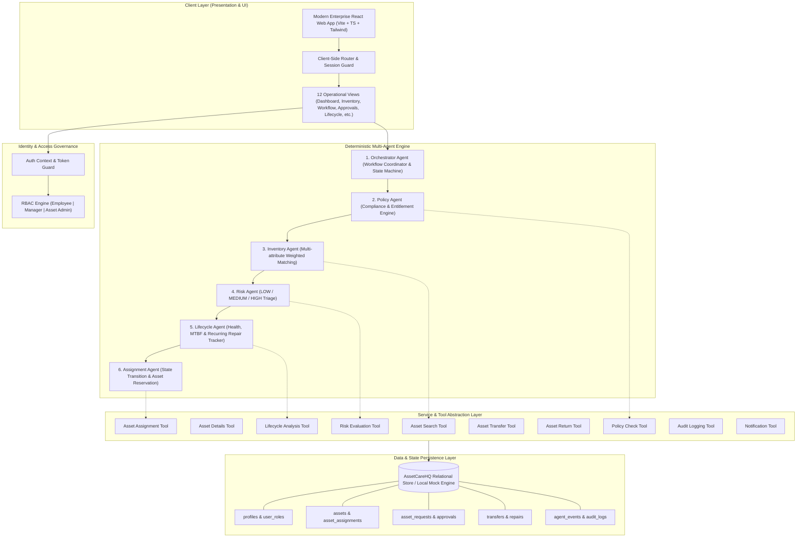
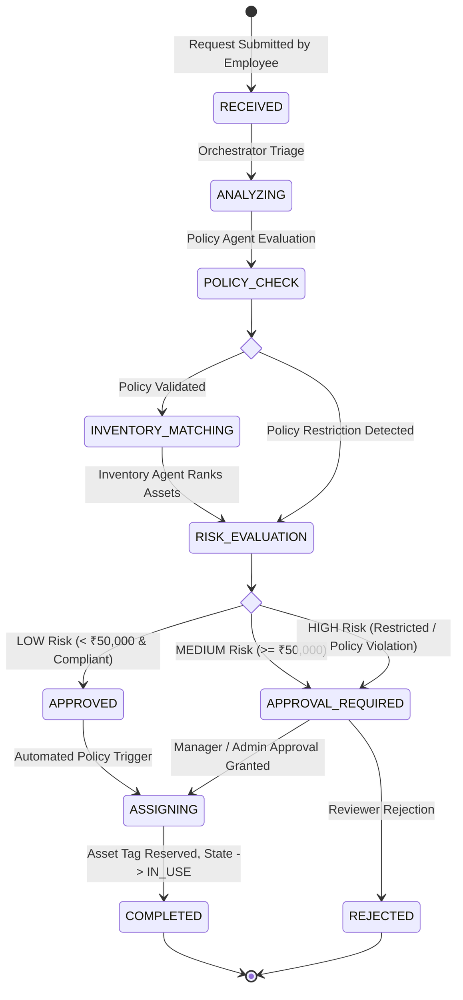

# AssetCareHQ — Enterprise Architecture Documentation

## 1. Executive Summary
**AssetCareHQ** is an Intelligent IT Asset Lifecycle & Operations Platform architected as an academic prototype for deterministic multi-agent orchestration. It demonstrates how autonomous agents can coordinate complex enterprise IT workflows—from asset procurement, inventory matching, and policy governance to risk evaluation, automated assignments, and lifecycle maintenance—while maintaining strict auditability and human-in-the-loop controls.

---

## 2. System Architecture Diagram

---

## 3. Multi-Agent Workflow Design

The core execution path for an asset request proceeds through a strict deterministic state machine:

### Deterministic Asset Matching Formula
The Inventory Agent ranks available candidates using multi-factor normalized scoring:
$$\text{Score} = (\text{RAM} \times 0.30) + (\text{Storage} \times 0.20) + (\text{CPU} \times 0.25) + (\text{Age} \times 0.15) + (\text{Location} \times 0.10)$$

### Lifecycle Health & Replacement Formula
The Lifecycle Agent calculates replacement urgency (0–100):
$$\text{Score} = \text{Age Score (25)} + \text{Warranty Expiry (20)} + \text{Repair Frequency (20)} + \text{Health Degradation (20)} + \text{Performance (15)}$$
- **0–39:** Healthy
- **40–69:** Monitor
- **70–100:** Replacement Recommended (Flags recurring repairs $\ge 3$ for identical failure modes).

---

## 4. Security & Access Governance Model

1. **Role-Based Access Control (RBAC):**
   - **Employee:** Submit requests, view personal assigned inventory, monitor workflow trace for personal tickets.
   - **Manager:** Employee privileges + review and approve/reject medium-risk tickets and inter-department asset transfers.
   - **Asset Admin:** Full supervisory access, manual asset assignments/returns/offboarding, role management, high-risk reviews, and demo scenario triggering.

2. **Auditable Event Logging:**
   - Every state transition, agent tool invocation, human approval, asset status change, and transfer is recorded with actor details, timestamps, and target resource identifiers.
   - The application interface does not provide normal users with controls to modify or purge historical audit records.
   - In a production deployment, audit records would be persisted in a server-side append-only or tamper-evident logging system.

3. **Safe Credentials & Mock Isolation:**
   - Zero hardcoded cloud secrets or private keys in the frontend source bundle.
   - Deterministic simulations eliminate runtime LLM cost, hallucination risk, and external API rate limit vulnerabilities.

---

## 5. Monitoring & Operational Metrics

The platform provides operational metrics across three analytical axes:
- **Agent Health & Execution Counts:** Run counts, success rates, and mean stage latencies (75–235ms simulation bounds).
- **Pipeline Throughput:** Open requests, pending human approvals, auto-approval ratio, and rejection rates.
- **Hardware Fleet Utilization:** Active vs. available inventory counts, warranty expiration pipeline, and proactive replacement candidates.

---

## 6. Deployment Strategy

- **Build Output:** Static, tree-shaken SPA bundle produced via Vite (`npm run build`).
- **Target Hosting:** Edge CDN platforms (Vercel, Netlify, Cloudflare Pages, or AWS S3 + CloudFront).
- **Environment Parity:** The application runs in offline/demo mode using seeded data and browser-based local persistence. The prototype is designed so that enterprise backend services such as Supabase/PostgreSQL can be integrated in a production deployment.

## 7. Prototype vs Production Architecture

AssetCareHQ is implemented as an academic prototype that demonstrates enterprise agentic workflow concepts without requiring external LLM infrastructure or enterprise systems.

### Current Prototype

- React/Vite frontend
- Deterministic simulated agents
- Browser-based persistence
- Seeded enterprise asset data
- Simulated policy, inventory, risk, lifecycle, and assignment tools
- Role-based UI access
- Human approval workflows
- Audit/event tracking
- Vercel deployment

### Production Extension

A production deployment would introduce:

- API Gateway
- Server-side agent orchestration
- Secure agent/tool gateway
- Enterprise Asset Management/CMDB integration
- PostgreSQL or enterprise database
- Centralized identity provider
- Server-side secrets management
- Append-only audit storage
- Centralized observability
- LLM-based reasoning where appropriate
- Human approval services
- Queue/event infrastructure for asynchronous workflows

The prototype therefore demonstrates the workflow and governance architecture while keeping external infrastructure dependencies intentionally limited.

### Failure & Exception Handling

The workflow supports explicit exception states:

- **No suitable asset:** Inventory matching fails and the request enters a failed state.
- **Policy violation:** The request is flagged as restricted and routed for elevated review.
- **High-risk request:** Human approval is required before assignment.
- **Approval rejection:** The requested action is stopped and the request remains auditable.
- **Workflow failure:** The workflow can enter a failed state rather than performing an uncontrolled assignment.
- **Recurring repair condition:** Repeated identical repairs trigger lifecycle replacement analysis.

## 8. Prototype Limitations

- Agents use deterministic business logic rather than live LLM reasoning.
- Enterprise systems such as CMDB, HRMS, procurement platforms, and ticketing systems are simulated rather than connected.
- Browser-based persistence is suitable for demonstration but not production-grade enterprise storage.
- Authentication and authorization in the prototype are simplified for academic demonstration.
- Production deployment would require centralized identity, server-side authorization, secure secrets management, durable audit storage, and centralized observability.
