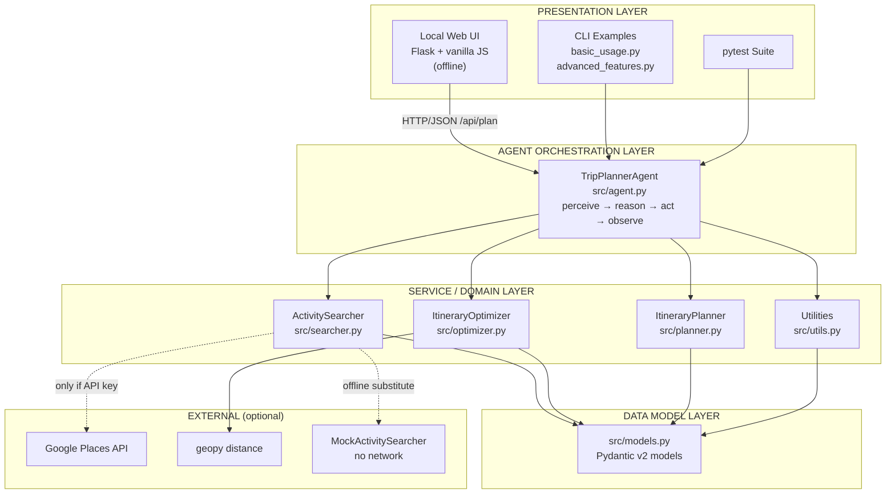
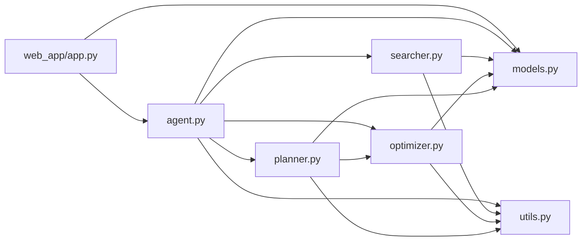
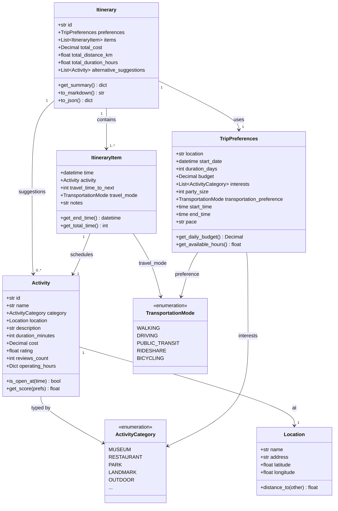
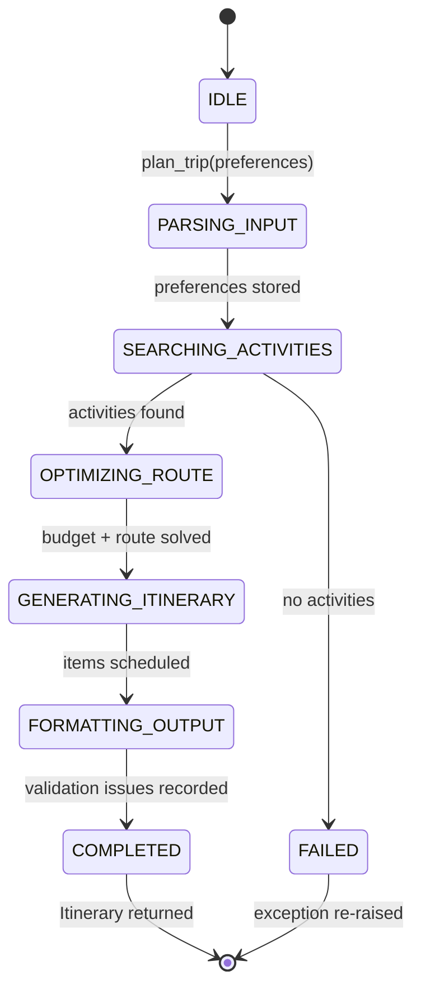
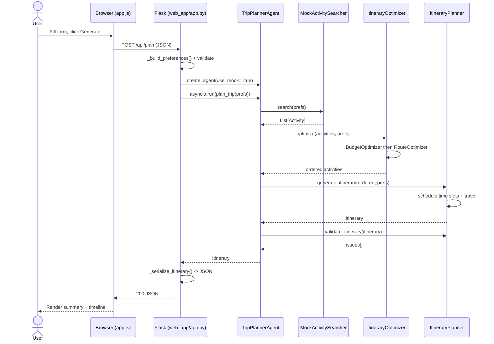
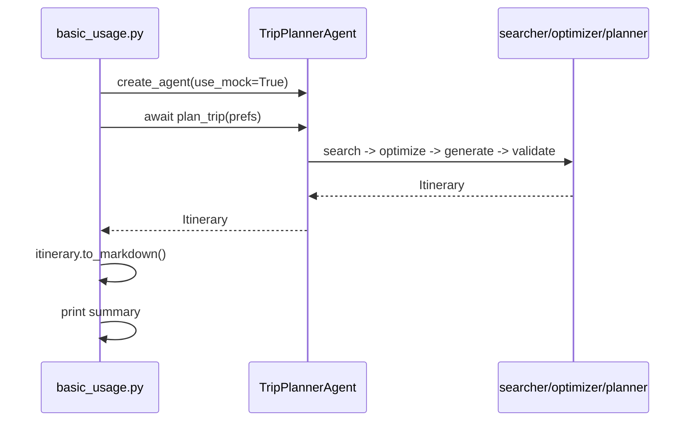
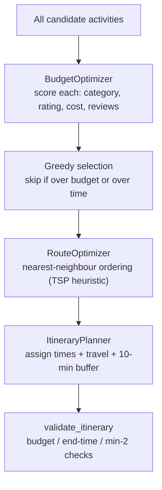
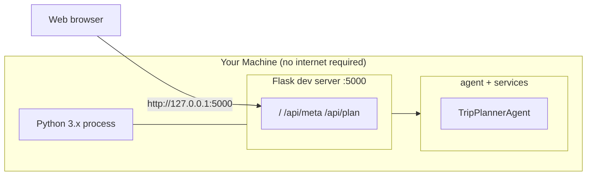

# Architecture Diagram

**Trip Planner Agent — implemented system architecture**

> This document describes the system **as actually built** in this repository.
> It complements [`DELIVERABLES.md`](DELIVERABLES.md), which contains the
> forward-looking enterprise architecture (with components such as PostgreSQL,
> Redis and cloud APIs that are *not* required for the local/offline build).

Diagrams are provided in two forms:

- **ASCII** — renders anywhere, including terminals and plain text viewers.
- **Mermaid** — renders natively on GitHub, GitLab and most Markdown viewers.

---

## 1. High-Level System Architecture

The system is a layered agent: a thin presentation layer (CLI examples or the
local web UI) drives a single orchestration agent, which delegates to four
focused service modules over a shared Pydantic data model.

### ASCII

```
┌───────────────────────────────────────────────────────────────────────────┐
│                        PRESENTATION LAYER                                 │
│                                                                           │
│   ┌─────────────────────┐    ┌──────────────────┐    ┌────────────────┐   │
│   │  Local Web UI       │    │  CLI Examples    │    │  Tests         │   │
│   │  (Flask + vanilla   │    │  basic_usage.py  │    │  pytest suite  │   │
│   │   JS, offline)      │    │  advanced_*.py   │    │                │   │
│   │  run_web.py / .bat  │    │                  │    │                │   │
│   └──────────┬──────────┘    └────────┬─────────┘    └───────┬────────┘   │
└──────────────┼────────────────────────┼──────────────────────┼────────────┘
               │  HTTP/JSON             │  Python call         │
               │  /api/plan             │                      │
               ▼                        ▼                      ▼
┌───────────────────────────────────────────────────────────────────────────┐
│                      AGENT ORCHESTRATION LAYER                            │
│                                                                           │
│   ┌───────────────────────────────────────────────────────────────────┐   │
│   │  TripPlannerAgent                    (src/agent.py)               │   │
│   │                                                                   │   │
│   │    perceive ──► reason ──► act ──► observe  (state machine)       │   │
│   │                                                                   │   │
│   │    state: AgentState   logs: List[AgentLog]                       │   │
│   └───────┬───────────────┬───────────────┬───────────────┬───────────┘   │
│           │               │               │               │               │
└───────────┼───────────────┼───────────────┼───────────────┼───────────────┘
            │               │               │               │
            ▼               ▼               ▼               ▼
┌───────────────────────────────────────────────────────────────────────────┐
│                          SERVICE / DOMAIN LAYER                           │
│                                                                           │
│  ┌──────────────┐ ┌──────────────┐ ┌──────────────┐ ┌──────────────────┐  │
│  │ Activity     │ │ Itinerary    │ │ Itinerary    │ │ Utilities        │  │
│  │ Searcher     │ │ Optimizer    │ │ Planner      │ │                  │  │
│  │ searcher.py  │ │ optimizer.py │ │ planner.py   │ │ utils.py         │  │
│  │              │ │              │ │              │ │                  │  │
│  │ .search()    │ │ .optimize()  │ │ .generate_   │ │ generate_id()    │  │
│  │              │ │              │ │  itinerary() │ │ format_*()       │  │
│  │ ┌──────────┐ │ │ ┌──────────┐ │ │ .validate_   │ │ validate_budget()│  │
│  │ │ Mock     │ │ │ │ Route    │ │ │  itinerary() │ │ rate_limit()     │  │
│  │ │ Searcher │ │ │ │ Optimizer│ │ │ .refine_     │ │ setup_logging()  │  │
│  │ │ (offline)│ │ │ │ Budget   │ │ │  itinerary() │ │                  │  │
│  │ └──────────┘ │ │ │ Optimizer│ │ │              │ │                  │  │
│  │              │ │ └──────────┘ │ │              │ │                  │  │
│  └──────┬───────┘ └──────┬───────┘ └──────┬───────┘ └──────────────────┘  │
│         │                │                │                               │
└─────────┼────────────────┼────────────────┼───────────────────────────────┘
          │                │                │
          ▼                ▼                ▼
┌───────────────────────────────────────────────────────────────────────────┐
│                          DATA MODEL LAYER   (src/models.py)               │
│                                                                           │
│   TripPreferences      Activity            ItineraryItem      Itinerary   │
│   Location             ActivityCategory    TransportationMode             │
│   AgentState           AgentLog                                           │
│                                                                           │
│                 ⚙ Pydantic v2 validation & serialization                  │
└───────────────────────────────────────────────────────────────────────────┘
          │
          ▼
┌───────────────────────────────────────────────────────────────────────────┐
│                       EXTERNAL INTEGRATION (optional)                     │
│                                                                           │
│   ┌────────────────────────┐   ┌───────────────────────────────────────┐  │
│   │  Google Places API     │   │  geopy (great-circle distance calc)   │  │
│   │  (only if API key set) │   │  local, no network                    │  │
│   └────────────────────────┘   └───────────────────────────────────────┘  │
│                                                                           │
│   ★ Offline mode: MockActivitySearcher replaces the network searcher,     │
│     so the whole stack runs with zero API keys and zero internet.         │
└───────────────────────────────────────────────────────────────────────────┘
```

### Mermaid



---

## 2. Component Map

Every runtime component, where it lives, and what it owns.

| Layer | Module | Primary Class / Entry | Responsibility |
|-------|--------|-----------------------|----------------|
| Presentation | `web_app/app.py` | `Flask app` (`/api/meta`, `/api/plan`) | Serve UI + JSON API, build/validate input |
| Presentation | `web_app/static/app.js` | IIFE | Form handling, render timeline, exports |
| Presentation | `web_app/templates/index.html` | — | Single-page UI markup |
| Presentation | `run_web.py` / `run_web.bat` | `main()` | Launch local server |
| Presentation | `examples/*.py` | `main()` | CLI usage demos |
| Orchestration | `src/agent.py` | `TripPlannerAgent` | Agent loop, state machine, logging |
| Orchestration | `src/agent.py` | `create_agent()` | Factory (`use_mock`, `api_keys`) |
| Service | `src/searcher.py` | `ActivitySearcher` | Google Places search + cache + retry |
| Service | `src/searcher.py` | `MockActivitySearcher` | Offline activity generator |
| Service | `src/optimizer.py` | `ItineraryOptimizer` | Combines budget + route optimization |
| Service | `src/optimizer.py` | `RouteOptimizer` | Nearest-neighbour TSP, travel time/distance |
| Service | `src/optimizer.py` | `BudgetOptimizer` | Score & select activities within budget |
| Service | `src/planner.py` | `ItineraryPlanner` | Time-slot scheduling, validation, export |
| Service | `src/utils.py` | functions | IDs, formatting, rate limiting, logging |
| Data | `src/models.py` | Pydantic models | Validation, serialization, scoring |

---

## 3. Module Dependency Graph



> **Import convention:** modules use *flat* imports (`from models import ...`),
> and every entry point inserts `src/` on `sys.path` before importing. There is
> no `src.` package prefix.

---

## 4. Data Model (Class Diagram)



---

## 5. Agent State Machine

`TripPlannerAgent.plan_trip()` walks through `AgentState` values. Each
transition appends an `AgentLog` entry (the *observe* step).



### ASCII

```
   plan_trip()
        │
        ▼
  ┌──────────────┐
  │    IDLE      │
  └──────┬───────┘
         ▼
  ┌──────────────────┐   store preferences
  │ PARSING_INPUT    │────────────────────┐
  └──────────────────┘                    │
                                          ▼
                              ┌────────────────────────┐
                              │ SEARCHING_ACTIVITIES   │  searcher.search()
                              └───────┬────────────────┘
                                      │
                    activities?  ─────┤
                       no             │ yes
                        ▼             ▼
                  ┌──────────┐  ┌───────────────────┐
                  │  FAILED  │  │ OPTIMIZING_ROUTE  │ optimizer.optimize()
                  └──────────┘  └─────────┬─────────┘
                                          ▼
                              ┌────────────────────────┐
                              │ GENERATING_ITINERARY   │ planner.generate_itinerary()
                              └───────────┬────────────┘
                                          ▼
                              ┌────────────────────────┐
                              │ FORMATTING_OUTPUT      │ planner.validate_itinerary()
                              └───────────┬────────────┘
                                          ▼
                                    ┌───────────┐
                                    │ COMPLETED │  → return Itinerary
                                    └───────────┘
```

---

## 6. Request Flow

### 6a. Web request (`POST /api/plan`)



### 6b. CLI request (`examples/basic_usage.py`)



---

## 7. Optimization Internals



**Scoring** (`Activity.get_score`) — max 100 points:

| Factor | Weight | Notes |
|--------|--------|-------|
| Category match | 40 | activity category ∈ interests |
| Rating | 30 | `(rating / 5) * 30` |
| Cost efficiency | 20 | cheaper relative to budget → more points |
| Review credibility | 10 | `min(10, reviews/100 * 10)` |

---

## 8. Runtime / Deployment View

The default build is a **single-process, single-machine, offline** application.


- **No database** — itineraries are returned in-memory; the searcher keeps an
  in-process dict cache.
- **No message queue / cache server** — concurrency is plain `asyncio` inside a
  single process.
- **No cloud dependency** — `MockActivitySearcher` supplies activities and
  `geopy` computes distances locally.

### Ports & endpoints

| Endpoint | Method | Purpose |
|----------|--------|---------|
| `/` | GET | Serves `index.html` |
| `/api/meta` | GET | Valid interests, transportation modes, paces |
| `/api/plan` | POST | Plan a trip; returns serialized itinerary JSON |

---

## 9. Trust Boundaries & Safety

| Boundary | Control |
|----------|---------|
| Browser → Flask | Bound to `127.0.0.1` only (not exposed to LAN) |
| User input → model | `_build_preferences()` clamps ranges (days 1–14, party 1–20, budget ≥ 0) |
| User input → DOM | `esc()` helper escapes all interpolated strings in `app.js` |
| Missing/invalid input | `400` with a human-readable message; no stack traces to client |
| External API | Only contacted if a key is supplied; `tenacity` retry + rate limiting |
| Transport | Fully offline by default → no data leaves the machine |

---

## 10. Source Tree

```
TripPlannerAgent/
├── src/                      # Core library (flat imports)
│   ├── models.py             # Pydantic data models
│   ├── agent.py              # TripPlannerAgent orchestrator
│   ├── searcher.py           # ActivitySearcher + MockActivitySearcher
│   ├── optimizer.py          # RouteOptimizer / BudgetOptimizer / ItineraryOptimizer
│   ├── planner.py            # ItineraryPlanner
│   └── utils.py              # Helpers
├── web_app/                  # Local offline web UI
│   ├── app.py                # Flask server + JSON API
│   ├── templates/index.html  # Single-page UI
│   └── static/               # style.css, app.js
├── examples/                 # basic_usage.py, advanced_features.py
├── tests/                    # pytest suite (incl. test_web_app.py)
├── docs/                     # prompt.md, DELIVERABLES.md, ARCHITECTURE.md
├── run_web.py / run_web.bat  # Web UI launchers
└── requirements.txt / setup.py
```

---

*See also: [`DELIVERABLES.md`](DELIVERABLES.md) (enterprise/forward-looking
architecture), [`../README.md`](../README.md) (usage), and
[`prompt.md`](prompt.md) (LLM regeneration prompt).*